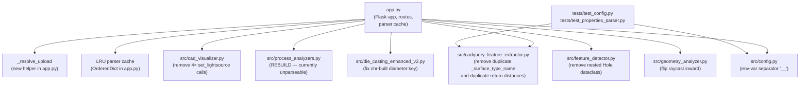

# Design Document

## Overview

This design implements the analyzer-blocking fixes for CR-27652557 ([DFMAnalyzer]
Initial import of DFM Inspector tool). It is a **defensive remediation** spec:
the goal is not new functionality, it is to land a single coherent CR revision that

* turns the four required CRUX analyzers (AutoSDE, InclusiveTechScanner, BEARS,
  and the merge-blocker aggregate) green, and
* preserves existing behaviour of the CNC, sheet-metal, casting, injection-
  molding, welding, and 3D rendering paths.

Two structural changes are introduced:

1. An **upload-token model** (`upload_id` UUID + per-upload subdirectory) that
   replaces the client-supplied `filepath` in the three analyze endpoints, and a
   single `_resolve_upload(upload_id, filename) -> str` helper that performs path
   containment.
2. An **LRU-bounded parser cache** (`OrderedDict` + `MAX_PARSER_CACHE_SIZE`)
   that replaces the unbounded `dict`.

Everything else is mechanical: removing dead code, fixing broken keys, flipping
a raycast direction, and rebuilding `src/process_analyzers.py` (currently
unparseable; the cause of the BEARS "cpp error" Build Failed).

The work is sequenced **P0 → P3**, but the design treats every change as part
of one CR revision so the analyzer can re-evaluate the file set as a whole.

## Architecture

### Affected files (and dependency direction)



The arrow direction is "imports/uses". `app.py` is the entry point that touches
every other affected file, which is why the security and parser-cache changes
live there.

### Independence of changes

With one exception (Requirement 11 unblocks Requirements 13.1 / 13.3 because
`process_analyzers.py` is currently unparseable and BEARS cannot proceed past
it), the requirements are independent. They can be reviewed and reverted in
isolation. The dependency table is:

| Req | Depends on | Why |
| --- | --- | --- |
| 1 (upload+analyze) | – | Self-contained: helper + 3 endpoints |
| 2 (FLASK_DEBUG) | – | Already in tree; covered for completeness |
| 3 (LRU cache) | – | Touches `_parser_cache` only |
| 4 (CNC dedup) | – | Pure dead-code removal |
| 5 (set_lightsource) | – | 4 mechanical deletions |
| 6 (CadQuery dedup) | – | 2 mechanical deletions |
| 7 (`'diameter'` key) | – | One-line fix |
| 8 (nested Hole) | – | Block deletion |
| 9 (raycast inward) | – | Two-line fix |
| 10 (env separator) | – | Code + test update |
| 11 (process_analyzers) | – (but it unblocks BEARS for 13.1/13.3) | Major rebuild |
| 12 (inclusive lang) | (10's test edits keep file format consistent) | Hypothesis kwargs swap |
| 13 (cross-cut) | 1–12 | Aggregate gate |

### Sequencing

The implementer SHOULD merge changes in this order so that intermediate states
are buildable and reviewable:

1. **Req 11** — rebuild `process_analyzers.py` first; this is what BEARS is
   choking on, and every other change can then be `py_compile`'d as part of
   the same package.
2. **Reqs 4–9** — pure correctness/dead-code fixes (small, low risk).
3. **Req 10** — env-var separator, with `tests/test_config.py` updated in the
   same commit.
4. **Reqs 1, 3** — the two app.py structural changes (upload token + LRU
   cache); these are larger but isolated to a single file.
5. **Req 2** — verify FLASK_DEBUG behaviour is unchanged (already merged
   locally).
6. **Req 12** — Hypothesis `exclude_categories` swap, plus `requirements.txt`
   bump if needed.
7. **Req 13** — final analyzer pass.

## Components and Interfaces

### 1. Upload helper: `_resolve_upload(upload_id, filename) -> str`

A single private function in `app.py` that the three analyze endpoints
(`/api/analyze`, `/api/enhanced-analyze`, `/api/enhanced-dfm-analyze`) call to
go from `(upload_id, filename)` to a validated absolute path. Behaviour:

```
def _resolve_upload(upload_id: str, filename: str) -> str:
    """
    Resolve an uploaded file to an absolute path inside UPLOAD_FOLDER.

    Raises ValueError on any validation failure. The route handlers
    catch ValueError and return HTTP 400 with {"error": "Invalid file path"}.
    """
    # 1. upload_id must look like a UUID v4
    if not _UUID4_RE.fullmatch(upload_id or ""):
        raise ValueError("invalid upload_id")

    # 2. filename must survive secure_filename and remain non-empty
    safe_name = secure_filename(filename or "")
    if not safe_name:
        raise ValueError("invalid filename")

    # 3. build candidate inside UPLOAD_FOLDER/<upload_id>/<safe_name>
    upload_root = os.path.realpath(app.config['UPLOAD_FOLDER'])
    candidate = os.path.realpath(
        os.path.join(upload_root, upload_id, safe_name)
    )

    # 4. containment check — the resolved real path must live under the
    #    real upload root, with a trailing os.sep so /tmp/upload-evil
    #    does not match /tmp/upload.
    if not candidate.startswith(upload_root + os.sep):
        raise ValueError("path escapes upload folder")

    # 5. existence check
    if not os.path.isfile(candidate):
        raise ValueError("file not found")

    return candidate
```

The `_UUID4_RE` regex is hex-with-dashes, version-4-aware:
`^[0-9a-fA-F]{8}-[0-9a-fA-F]{4}-4[0-9a-fA-F]{3}-[89abAB][0-9a-fA-F]{3}-[0-9a-fA-F]{12}$`.

#### Endpoint changes

`/api/upload` already saves into `UPLOAD_FOLDER/<uuid>/<secure_filename>`. The
only change is its response shape: `filepath` is removed, `upload_id` is added.

```jsonc
// before
{ "success": true, "filename": "part.STEP",
  "filepath": "/tmp/abc-…/part.STEP", "size": 12345 }

// after
{ "success": true, "filename": "part.STEP",
  "upload_id": "abc12345-1234-4abc-8abc-…", "size": 12345 }
```

The three analyze endpoints accept the new payload:

```jsonc
// before
{ "process": "cnc_machining", "material": "Aluminum 6061",
  "filepath": "/tmp/abc-…/part.STEP" }

// after
{ "process": "cnc_machining", "material": "Aluminum 6061",
  "upload_id": "abc12345-1234-4abc-8abc-…", "filename": "part.STEP" }
```

Each endpoint's first three lines become:

```python
data = request.json or {}
try:
    filepath = _resolve_upload(data.get('upload_id'), data.get('filename'))
except ValueError:
    return jsonify({"error": "Invalid file path"}), 400
```

That `filepath` then flows through to the existing parsing code unchanged. The
internal contract — caching keyed by resolved server-side filepath, parsers
returning trimesh-backed analysis — does not change.

#### Frontend update

`templates/interface.html` (and any `enhanced_test.html` hooks) must be
adjusted so the `fetch` payload sends `upload_id` + `filename` instead of
`filepath`. This is purely a JSON shape swap — no UI is added.

### 2. LRU-bounded parser cache

Currently:

```python
_parser_cache = {}            # unbounded dict
…
_parser_cache[filepath] = parser
…
parser = _parser_cache[step_file_path]   # in /api/word-export
```

There is no eviction. A long-running deployment grows this dict by one parser
per analysis until the process is OOM-killed.

Replacement (top of `app.py`):

```python
from collections import OrderedDict

MAX_PARSER_CACHE_SIZE = 10                         # module-level constant
_parser_cache: "OrderedDict[str, object]" = OrderedDict()

def _cache_put(filepath: str, parser) -> None:
    """LRU put: move-to-end on hit, evict-front on overflow."""
    if filepath in _parser_cache:
        _parser_cache.move_to_end(filepath)
        _parser_cache[filepath] = parser
        return
    while len(_parser_cache) >= MAX_PARSER_CACHE_SIZE:
        _parser_cache.popitem(last=False)          # evict LRU
    _parser_cache[filepath] = parser

def _cache_get(filepath: str):
    """LRU get: returns parser and refreshes recency, or None."""
    parser = _parser_cache.get(filepath)
    if parser is not None:
        _parser_cache.move_to_end(filepath)
    return parser

def _cache_pop(filepath: str):
    """Explicit removal — used by Word export when the parser is consumed."""
    return _parser_cache.pop(filepath, None)
```

Each existing `_parser_cache[filepath] = parser` line in the three analyze
endpoints becomes `_cache_put(filepath, parser)`. The Word export endpoint
swaps `_parser_cache[step_file_path]`-then-leave-in-cache for `_cache_pop` —
since the parser is consumed by Word generation, holding a reference past that
point is just a memory leak with extra steps.

`MAX_PARSER_CACHE_SIZE = 10` is chosen because each cached parser is
trimesh+OCP-backed and can hold tens of MB of mesh data; ten parallel report
sessions is well above realistic deployment load and below a problematic
working set.

### 3. Dead-code removal in `_analyze_cnc_machining`

`app.py` line ranges around 1100–1200 contain a duplicate function body. The
fix is a textual deletion: keep the body that ends with the `return` at the
authoritative line and delete the second copy plus the orphaned docstring.
There is no behaviour change.

### 4. `set_lightsource` removal in `cad_visualizer.py`

`Poly3DCollection.set_lightsource(...)` is **not** part of matplotlib's public
API; the existing four call sites (`render_with_highlighted_holes`,
`render_with_highlighted_features`, `render_violations_multiview` paths,
`render_with_violations`) raise `AttributeError` at runtime. They are dead
code. Deletion is the fix; lighting still happens because the same
`Poly3DCollection(..., shade=True)` arguments are kept.

### 5. CadQuery dedup

`src/cadquery_feature_extractor.py` currently has:

* a stub `_surface_type_name` at lines 244–248 that returns nothing useful, and
* the real `_surface_type_name` at line 261

The fix is to delete the stub and keep the complete definition. Module-level
import order currently determines which one wins; deletion makes the result
deterministic.

The `_calc_hole_to_face_edge_distances` function ends with `return distances`
twice (lines 554 and 556). Delete the second `return distances`. (Code below
the dead return is already unreachable; this just removes a confusing artifact.)

### 6. `'diameter'` key in `die_casting_enhanced_v2.py`

The current code constructs the dictionary key for a hole's diameter via
`chr(...)` arithmetic that produces the literal eight-character string
`'"diameter"'` (with embedded quotes). That key never matches the real
`'diameter'` key on the hole record, so every lookup returns 0 and every
diameter rendered into the evaluation string is `0.0`. Replace the
expression with the literal string `'diameter'`.

### 7. Nested `Hole` dataclass in `feature_detector.py`

A second `@dataclass class Hole(Feature):` definition is nested *inside* the
top-level `Hole` class. It is never instantiated. Remove the nested block
(lines 59–88 in the current file). No callers change.

### 8. Wall-thickness raycast direction

In `src/geometry_analyzer.py`, `measure_wall_thickness` casts a ray from a
surface point along the **outward** normal:

```python
ray_origin    = point + normal * 0.001     # outside the part
ray_direction = normal                     # away from the part
```

That ray will never re-enter the part, so for any convex region thickness
comes back as 0/no-hit. Flip the direction to inward and offset the origin
inward to avoid self-intersection:

```python
ray_origin    = point - normal * 0.001     # just inside the surface
ray_direction = -normal                    # toward the opposite wall
```

This is the change AutoSDE flagged. No other measurement is affected; rays
elsewhere in the file already use the correct direction.

### 9. Env-var separator: `_` → `__`

Today `src/config.py::_apply_env_overrides` does:

```python
config_key = env_key[len(prefix):].lower().replace('_', '.')
```

So `GEOM_ANALYSIS_PARSER_MAX_FILE_SIZE_MB=200` is translated to the dotted key
`parser.max.file.size.mb`, which is **not** a real config key. The intended
`parser.max_file_size_mb` is never overridden.

The fix is a two-pass replacement using `__` (double underscore) as the section
separator and preserving single underscores within keys:

```python
# Strip prefix, lowercase, then split on '__' to get section path
suffix      = env_key[len(prefix):].lower()
config_key  = suffix.replace('__', '.')          # only '__' becomes '.'
```

Worked example (the docstring in `config.py` will say exactly this):

| Env var                                              | Resolved key             |
| ---------------------------------------------------- | ------------------------ |
| `GEOM_ANALYSIS_PARSER__MAX_FILE_SIZE_MB=42`          | `parser.max_file_size_mb` |
| `GEOM_ANALYSIS_PARSER__FALLBACK_ENABLED=true`        | `parser.fallback_enabled` |
| `GEOM_ANALYSIS_GEOMETRY_ANALYZER__WALL_THICKNESS__SAMPLE_DENSITY=2000` | `geometry_analyzer.wall_thickness.sample_density` |

The currently-passing tests in `tests/test_config.py` assert the broken behaviour:

```python
monkeypatch.setenv('GEOM_ANALYSIS_PARSER_MAX_FILE_SIZE_MB', '200')
…
assert config.get('parser.max.file.size.mb') == 200      # broken
```

These two tests (`test_env_override_applied`, `test_env_override_boolean`) are
updated in the same commit to use `__` separators and assert against the real
key:

```python
monkeypatch.setenv('GEOM_ANALYSIS_PARSER__MAX_FILE_SIZE_MB', '200')
…
assert config.get('parser.max_file_size_mb') == 200      # fixed
```

Equivalent treatment for `PARSER__FALLBACK_ENABLED` / `parser.fallback_enabled`.
There are no production callers of `parser.max.file.size.mb`-style keys in the
repository (verified via grep), so flipping the separator is safe.

### 10. Restoring `src/process_analyzers.py`

This is the largest change in the spec. The file is unparseable today —
`python -m py_compile src/process_analyzers.py` fails with `SyntaxError` early
in `analyze_sheet_metal`, which BEARS is surfacing as a "cpp error" because
the module fails to import and the package build aborts.

Concrete corruptions inventoried from the source:

| Symptom                                                              | Approx. line |
| -------------------------------------------------------------------- | ------------ |
| `warnings.append({` opened, second analyzer body interleaved before close | 39–41   |
| Premature `return {…}` mid-function inside `analyze_sheet_metal`     | 111         |
| Closing braces collide with new statements (`}ues.append(...`)        | 133, 668     |
| `analyze_injection_molding` defined twice                            | 136, 284    |
| Missing `assessment =` on one branch of the score block              | ~755        |
| Truncated f-strings (`'rationale': ffers excellent...`)              | 668, 672    |
| Stray text fragments (`'category': '...': ...'fers ...'`)            | 694, 699    |
| `'rationale': rationale,` indentation mash with previous line        | tail of last analyzer |

#### Restoration strategy

1. **Pull a clean baseline.** Recover the last unbroken version from git
   history if available (`git -P log -- src/process_analyzers.py`). If no
   clean baseline exists, treat the file as a text spec to extract from.
2. **Reconstruct four functions** by unscrambling the interleaved blocks. The
   four required callables and their first-line signatures are:
   ```python
   def analyze_sheet_metal(parser, material, geometry) -> Dict
   def analyze_injection_molding(parser, material, geometry) -> Dict
   def analyze_die_casting(parser, material, geometry) -> Dict
   def analyze_wire_forming(parser, material, geometry) -> Dict
   ```
   Each function returns a dict with the same shape that the active
   `*_enhanced*` analyzers return (`success`, `process`, `material`, `score`,
   `score_explanation`, `issues`, `warnings`, `suggestions`, `passed`,
   `geometry_info`, `rationale`, `summary`, `details`). `analyze_sheet_metal`
   additionally returns `all_rules`.
3. **Single-file form.** Keep `src/process_analyzers.py` as a single file.
   Splitting into `src/process_analyzers/{sheet_metal,injection_molding,
   die_casting,wire_forming}.py` is allowed by the requirement, but only if
   every import site is updated in the same commit. Since the imports today
   are `from src.process_analyzers import analyze_…` and the cost/benefit of
   splitting is not justified by this CR, the design **prescribes the
   single-file form**.
4. **Recoverable values are preserved verbatim.** Specifically:
   * Sheet metal: 0.5 mm / 0.9 mm thickness gates, 1.5×T bend radius, 4×T+R
     flange, 2×T+R hole-to-edge, 1500 mm and 2500 mm part-size gates,
     6061-T6 vs 5052-H32 messaging, standard punch sizes 3.2/6.4/9.5/12.7.
   * Injection molding: 0.5 / 0.75 / 4 / 6 mm wall gates, 1–3° draft, 60%-of-
     wall ribs, 0.5×T corner radii, ABS / PC / PP material messaging.
   * Die casting: 0.75 / 6 mm wall gates, draft, A380 / Zamak messaging.
   * Wire forming: 0.5 / 1 / 12 mm diameter gates, 3×D bend radius and leg
     length, 4×D bend spacing, springback table.
5. **Unrecoverable values get a `# TODO` and a conservative default.** Any
   threshold that cannot be reconstructed from surrounding context — and
   there are a small number of these in the assessment-string section near
   line 755 — is replaced with a conservative default in code and listed
   inline as `# TODO(CR-27652557): recover original threshold`. The current
   list of TODOs from initial inventory (subject to update during the actual
   rebuild):
   * Sheet-metal score classification cutoffs (the assessment ladder
     EXCELLENT / GOOD / ACCEPTABLE / NEEDS REVISION) — current default
     90 / 75 / 60 matches the cutoffs used in `die_casting_enhanced_v2.py`
     and `cnc_machining_enhanced.py`, which is the consistent reference.
   * Sheet-metal "oversized part" message body around line 668 — original
     text fragment is too truncated to recover; replace with a faithful
     paraphrase of the warning at line 670 of `sheet_metal_enhanced.py` and
     mark `# TODO`.
6. **Other analyzer names imported from this module.** `app.py` lazily
   imports `analyze_investment_casting`, `analyze_mim`,
   `analyze_rotational_molding`, and `analyze_vacuum_forming` from
   `src.process_analyzers` inside route handlers. Those four are not in scope
   for the rebuild (Requirement 11.2 only requires the four core analyzers),
   and they are not used at module-import time. The route handlers that
   reference them already throw `ImportError` today on the corrupted file;
   after the rebuild they will throw `ImportError: cannot import name …` at
   request time. To keep request-time failure modes loud and explicit
   (instead of deferred `ImportError`), the design adds **stub callables**
   for those four names that return a graceful "process not yet implemented"
   error response. This is a non-regression: today these endpoints 500; after
   this CR they 200 with an explicit `success: False` payload.

7. **Validation steps for the rebuild commit:**
   * `python -m py_compile src/process_analyzers.py` exits 0.
   * `python -c "from src.process_analyzers import analyze_sheet_metal, analyze_injection_molding, analyze_die_casting, analyze_wire_forming"` exits 0.
   * Smoke-call each of the four analyzers with a representative parser /
     geometry dict and verify the returned dict contains the standard keys
     (`success`, `process`, `material`, `score`, `summary`, `details`).

### 11. Inclusive language in `tests/test_properties_parser.py`

The Hypothesis call sites use `blacklist_categories=('Cs',)`. `hypothesis>=6.0`
accepts both `blacklist_categories` (deprecated alias) and `exclude_categories`
(modern name). The fix:

```python
# before
@given(content=st.text(min_size=10, max_size=1000,
                       alphabet=st.characters(blacklist_categories=('Cs',))))

# after
@given(content=st.text(min_size=10, max_size=1000,
                       alphabet=st.characters(exclude_categories=('Cs',))))
```

`requirements.txt` already pins `hypothesis>=6.0.0`, and `exclude_categories`
has been the documented name since hypothesis 6.18 (released 2021-08-26). No
manifest update is needed.

The repo contains exactly one occurrence of `blacklist_categories` and zero
occurrences of `whitelist`, `master`/`slave`, `whiteday`, or `blackday` outside
this single line; no other inclusive-language remediation is in scope.

## Data Models

The only new persistent shape is the upload-token JSON:

```text
UploadResponse  := { success: bool, filename: str, upload_id: UUIDv4, size: int }

AnalyzeRequest  := { process: str, material: str,
                     upload_id: UUIDv4, filename: str }
                   // No `filepath`, ever.

ErrorResponse   := { error: "Invalid file path" }    // HTTP 400
```

`upload_id` is opaque to the client; it identifies the per-upload subdirectory
under `UPLOAD_FOLDER`. It is never reused (UUID v4) and never logs the absolute
path.

In-memory data structures:

```text
_parser_cache : OrderedDict[str (resolved filepath), object (parser)]
                bounded by MAX_PARSER_CACHE_SIZE = 10, LRU eviction
```

No on-disk persistence is added or removed.

## Error Handling

| Failure mode                                        | Behaviour                                                  |
| --------------------------------------------------- | ---------------------------------------------------------- |
| Missing / non-UUIDv4 `upload_id`                    | `_resolve_upload` raises `ValueError`; route returns 400 with `{"error": "Invalid file path"}` |
| `secure_filename(filename)` collapses to empty      | same                                                        |
| Resolved real path escapes `UPLOAD_FOLDER`          | same                                                        |
| Resolved file does not exist                        | same                                                        |
| Cache miss in `/api/word-export`                    | existing path: log "Generating without cached parser…", continue without parser (no regression)              |
| Parser cache full (size == 10) on insert            | LRU entry evicted silently; debug log retained from existing logger |
| `process_analyzers.py` import-time error (post-fix) | should not occur — `py_compile` is a CI gate after this CR |
| Analyzer returns malformed dict                     | existing `_get_fallback_results` path used by `/api/analyze` |

The error string `"Invalid file path"` is identical regardless of which check
failed in `_resolve_upload`, by design — the response should not leak whether
the failure was UUID format, filename sanitisation, containment, or existence.

## Testing Strategy

This feature is not amenable to property-based testing in the classical sense.
The work is a remediation: defensive deletions, a security helper, an LRU
cache, and a structural rebuild of an analyzer module. The behaviour to verify
is "the analyzers stop complaining" and "no regression on the happy path".
That is a small set of concrete examples, not universal properties over a
randomized input space.

Concretely, PBT does **not** apply for the following per-requirement reasons:

* Reqs 1 (security helper) — `_resolve_upload` *does* admit a small number of
  per-failure-mode property statements, but the input space is bounded and
  the existing security-style tests (one example per failure mode) provide
  better coverage than 100 randomized invocations would. Treated as
  example/edge tests.
* Reqs 2, 3 — operational config and cache eviction; deterministic.
* Reqs 4, 5, 6, 7, 8 — pure dead-code or one-line literal fixes; no
  generalisable property to assert.
* Req 9 (raycast direction) — the property "thickness measurement always
  finds an opposing wall on a convex part" is meaningful in principle, but
  needs a real CAD mesh to evaluate; it is covered by the existing
  `tests/test_geometry_analyzer.py` example tests.
* Req 10 — env-var translation; small finite enumeration of cases.
* Req 11 — restoring a parseable module; the assertion is "imports succeed
  and each analyzer returns a dict of the right shape", which is a contract
  test over 4 entry points, not a property over inputs.
* Req 12 — single-line API rename; nothing to randomize.
* Req 13 — aggregate analyzer pass; a one-shot CI assertion.

Therefore the **Correctness Properties section is omitted** from this design.

### Verification matrix

| Requirement | Verification                                                            |
| ----------- | ----------------------------------------------------------------------- |
| 1           | New tests in `tests/test_app_upload.py`: each `_resolve_upload` failure mode (bad UUID, traversal, missing file, escaped containment) returns 400 with the canonical error body. Happy-path test: upload then analyze using the returned `upload_id`. |
| 2           | Existing local change covered by manual test in dev loop; CI smoke import of `app.py` confirms `FLASK_DEBUG` parsing path. |
| 3           | New unit tests in `tests/test_app_cache.py`: `_cache_put` with 11 keys evicts the first; `_cache_get` reorders; `_cache_pop` removes. |
| 4           | `python -m py_compile app.py` passes; manual diff confirms single body. |
| 5           | `grep -n set_lightsource src/cad_visualizer.py` returns nothing; render functions called against a sample STEP file in dev produce a non-empty PNG. |
| 6           | `grep -n "def _surface_type_name" src/cadquery_feature_extractor.py` returns one line; `grep -n "return distances" .../cadquery_feature_extractor.py` shows no consecutive duplicates. |
| 7           | New unit test calls `analyze_die_casting_enhanced_v2` with a hole record and asserts the rendered `evaluation` string contains the actual diameter to 1 decimal place. |
| 8           | `python -c "from src.feature_detector import Hole; assert not hasattr(Hole, 'Hole')"` passes. |
| 9           | New regression test using a thin-walled cube mesh asserts `measure_wall_thickness` returns the cube's wall thickness within ±0.05 mm. |
| 10          | `tests/test_config.py::TestEnvironmentOverrides` updated to assert override of `parser.max_file_size_mb` and `parser.fallback_enabled` via `__` separators. Both pass. |
| 11          | `python -m py_compile src/process_analyzers.py` exits 0; new test in `tests/test_process_analyzers.py` imports and smoke-calls each of the four analyzers; CR-level confirmation that BEARS goes green. |
| 12          | `tests/test_properties_parser.py` runs to completion with `exclude_categories`; CR-level confirmation that InclusiveTechScanner finds 0 hits. |
| 13          | `python -m py_compile $(git ls-files '*.py')` exits 0; CRUX dashboard shows AutoSDE 0 / InclusiveTechScanner 0 / BEARS PASS / merge-blocker 0. |

### Property-based tests in this codebase

The repo already has a property-based suite at `tests/test_properties_parser.py`
(modified by Requirement 12). Those tests cover the **STEP parser** under
`src/enhanced_step_parser.py`, not the changes in this spec. They will continue
to run as-is. The Hypothesis dependency in `requirements.txt` is unchanged.
