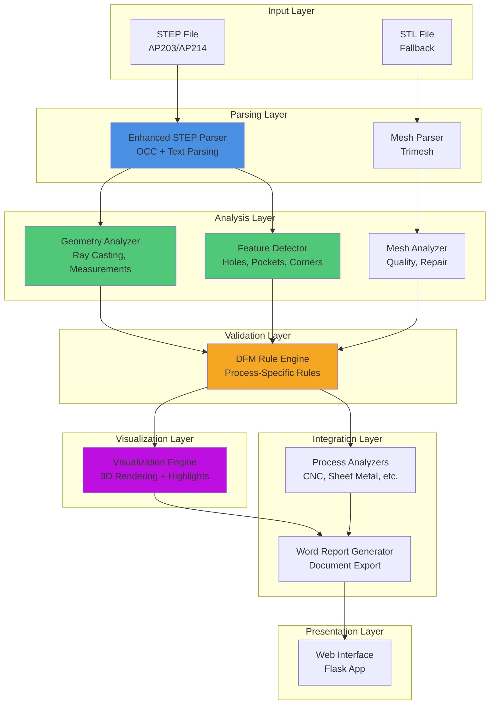
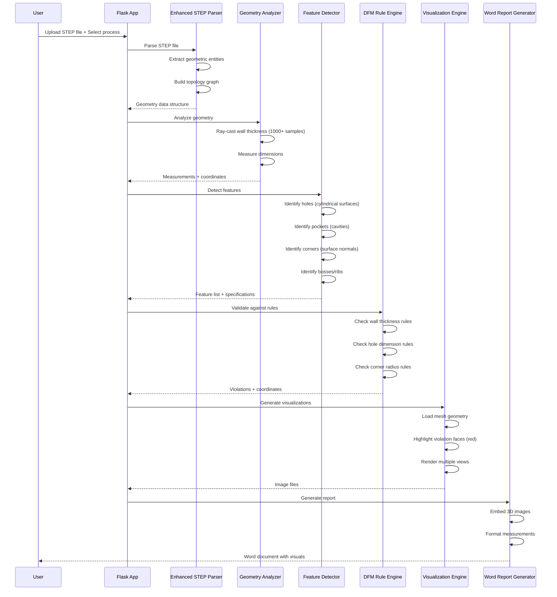

# Design Document: Enhanced 3D Geometry Analysis and Visualization

## Overview

The Enhanced 3D Geometry Analysis and Visualization feature transforms the DFM Inspector from an estimation-based system to a precision measurement system. Currently, the application uses bounding box approximations and simplified thickness calculations that produce false positives and inaccurate DFM assessments. This design implements accurate STEP file parsing, precise mesh-based measurements, comprehensive feature detection, and enhanced 3D visualization with error highlighting.

### Problem Statement

The current system (`simple_cad_parser.py`) provides only rough estimates:
- Wall thickness estimated as 3-5% of smallest dimension
- No actual feature detection (holes, pockets, corners)
- Bounding box used instead of real geometry analysis
- No coordinate tracking for violation locations
- Generic 3D visualizations without specific problem highlighting

### Solution Approach

This design introduces a multi-layered geometry analysis pipeline:

1. **Enhanced STEP Parser**: Extracts complete geometric entities (surfaces, edges, vertices, topology) from STEP AP203/AP214 files with ±0.01mm accuracy
2. **Geometry Analyzer**: Performs ray-casting based wall thickness measurement with 1000+ samples per m²
3. **Feature Detector**: Identifies manufacturing-critical features (holes, pockets, bosses, ribs, corners) with precise dimensions and coordinates
4. **Mesh Analyzer**: Evaluates mesh quality, performs watertight checking, and automatic repair
5. **DFM Rule Engine**: Validates features against process-specific rules using measured (not estimated) values
6. **Visualization Engine**: Generates CAD-quality 3D renderings with red highlighting of specific violation locations

### Key Benefits

- **Accuracy**: ±0.01mm measurement tolerance vs ±10-20mm estimation errors
- **Specificity**: Exact coordinates for every violation vs vague "part has thin walls"
- **Visual Clarity**: Red-highlighted problem areas in 3D vs generic part rendering
- **Confidence**: Real measurements vs estimates that machine shops reject
- **Completeness**: All 20 requirements addressed with comprehensive feature coverage


## Architecture

### High-Level System Architecture



### Data Flow



### Component Integration Points

**Enhanced STEP Parser → Geometry Analyzer**
- Data: Vertex coordinates, face normals, edge connectivity
- Format: NumPy arrays + topology dictionary
- Interface: `get_vertices()`, `get_faces()`, `get_normals()`, `get_topology()`

**Geometry Analyzer → Feature Detector**
- Data: Surface samples, thickness measurements, coordinate grid
- Format: Structured arrays with (x, y, z, value) tuples
- Interface: `get_thickness_map()`, `get_surface_samples()`

**Feature Detector → DFM Rule Engine**
- Data: Feature objects (Hole, Pocket, Wall, Corner, Boss, Rib)
- Format: Python dataclasses with dimensions + coordinates
- Interface: `get_detected_features()` returns `List[Feature]`

**DFM Rule Engine → Visualization Engine**
- Data: Violation objects with feature references + coordinates
- Format: `Violation` dataclass with `feature_id`, `rule_name`, `coordinates`
- Interface: `get_violations()` returns `List[Violation]`

**Visualization Engine → Word Report Generator**
- Data: Image file paths + metadata
- Format: Dictionary with `{'image_path': str, 'caption': str, 'rule': str}`
- Interface: `get_visualization_paths()` returns `List[Dict]`

### Backward Compatibility Strategy

The Enhanced STEP Parser maintains the same interface as `SimpleCADParser`:

```python
# Existing interface (preserved)
parser.load() -> bool
parser.get_analysis_summary() -> Dict
parser.get_bounding_box() -> Tuple[float, float, float]
parser.get_volume() -> float
parser.get_surface_area() -> float

# New interface (extended)
parser.get_features() -> List[Feature]
parser.get_measurements() -> Dict[str, Measurement]
parser.get_mesh() -> trimesh.Trimesh
```

Existing process analyzers receive enhanced data through the same `geometry` dictionary, but with real measurements replacing estimates:

```python
# Before (estimated)
geometry = {
    'estimated_min_thickness': 2.0,  # Rough guess
    'dimensions': {'x': 100, 'y': 100, 'z': 50}
}

# After (measured)
geometry = {
    'measured_min_thickness': 1.23,  # Actual measurement
    'min_thickness_location': (45.2, 67.8, 12.3),  # Exact coordinates
    'dimensions': {'x': 98.45, 'y': 102.31, 'z': 48.92},  # Precise
    'features': {
        'holes': [...],  # Detected holes with specs
        'pockets': [...],  # Detected pockets
        'corners': [...]  # Detected corners
    }
}
```


## Components and Interfaces

### 1. Enhanced STEP Parser

**Purpose**: Extract complete geometric data from STEP AP203/AP214 files with ±0.01mm accuracy.

**Architecture**:
```python
class EnhancedSTEPParser:
    """
    Multi-method STEP parser with fallback strategies
    """
    def __init__(self, file_path: str):
        self.file_path = file_path
        self.shape = None  # OCC TopoDS_Shape
        self.mesh = None   # trimesh.Trimesh
        self.entities = {} # Geometric entities
        self.topology = {} # Connectivity graph
        
    def load(self) -> bool:
        """Load STEP file using best available method"""
        # Method 1: OCC (OpenCascade) - most accurate
        # Method 2: Text parsing - reliable for coordinates
        # Method 3: Fallback to existing STEPParser
        
    def extract_geometric_entities(self) -> Dict:
        """Extract surfaces, edges, vertices"""
        return {
            'vertices': np.ndarray,  # (N, 3) coordinates
            'edges': List[Tuple[int, int]],  # Vertex pairs
            'faces': np.ndarray,  # (M, 3) triangle indices
            'normals': np.ndarray,  # (M, 3) face normals
            'surfaces': List[Surface]  # Parametric surfaces
        }
    
    def build_topology(self) -> Dict:
        """Build connectivity graph"""
        return {
            'vertex_to_edges': Dict[int, List[int]],
            'edge_to_faces': Dict[int, List[int]],
            'face_adjacency': Dict[int, List[int]]
        }
    
    def get_mesh(self) -> trimesh.Trimesh:
        """Get triangulated mesh representation"""
        
    def validate_geometry(self) -> Tuple[bool, List[str]]:
        """Check for corrupted geometry"""
        # Check: watertight, manifold, degenerate triangles
```

**Key Algorithms**:

1. **STEP Entity Extraction**:
```
For each entity in STEP file:
    If entity is CARTESIAN_POINT:
        Extract (x, y, z) coordinates
        Store in vertex array
    If entity is CIRCLE:
        Extract center, radius, axis
        Create cylindrical surface representation
    If entity is PLANE:
        Extract origin, normal
        Create planar surface representation
    If entity is ADVANCED_FACE:
        Extract face-edge connectivity
        Build topology graph
```

2. **Topology Building**:
```
Initialize empty adjacency lists
For each face in mesh:
    For each edge in face:
        Add face to edge_to_faces[edge]
        For each adjacent face sharing edge:
            Add to face_adjacency[face]
```

3. **Error Handling**:
```
Try:
    Parse with OCC
Except OCC_Error:
    Try:
        Parse with text extraction
    Except Parse_Error:
        Return descriptive error:
            - Line number of failure
            - Entity type that failed
            - Suggested fix
```

**Interface**:
```python
# Public methods
load() -> bool
get_vertices() -> np.ndarray
get_faces() -> np.ndarray
get_normals() -> np.ndarray
get_topology() -> Dict
get_mesh() -> trimesh.Trimesh
get_analysis_summary() -> Dict  # Backward compatible
```


### 2. Geometry Analyzer

**Purpose**: Measure wall thickness, dimensions, and geometric properties with ±0.01mm accuracy.

**Architecture**:
```python
class GeometryAnalyzer:
    """
    Precise geometry measurement using ray casting and spatial indexing
    """
    def __init__(self, mesh: trimesh.Trimesh):
        self.mesh = mesh
        self.spatial_index = None  # BVH or Octree
        self.thickness_map = {}
        self.measurements = {}
        
    def measure_wall_thickness(self, sample_density: int = 1000) -> Dict:
        """
        Measure wall thickness at multiple sample points
        
        Args:
            sample_density: Points per square meter
            
        Returns:
            {
                'min_thickness': float,
                'min_location': (x, y, z),
                'thickness_map': Dict[(x,y,z), float],
                'samples': int
            }
        """
        
    def measure_dimensions(self) -> Dict:
        """Measure precise bounding box dimensions"""
        
    def calculate_volume(self) -> float:
        """Calculate volume using mesh integration"""
        
    def calculate_surface_area(self) -> float:
        """Calculate surface area from mesh faces"""
```

**Key Algorithms**:

1. **Wall Thickness Measurement (Ray Casting)**:
```
Algorithm: measure_wall_thickness()
Input: mesh, sample_density
Output: thickness_map, min_thickness, min_location

1. Build spatial index (BVH tree) for fast ray intersection
2. Calculate required samples: 
   samples = surface_area * sample_density / 1000000
3. Generate sample points on surface:
   points = mesh.sample(samples)
4. For each sample point p:
   a. Get surface normal n at p
   b. Cast ray from p in direction n
   c. Find intersection with mesh (opposite surface)
   d. If intersection found at point q:
      - distance = ||q - p||
      - thickness_map[p] = distance
      - If distance < min_thickness:
          min_thickness = distance
          min_location = p
5. Return {min_thickness, min_location, thickness_map, samples}

Time Complexity: O(n log m) where n=samples, m=faces
Space Complexity: O(n + m)
```

2. **Spatial Indexing (BVH Tree)**:
```
Algorithm: build_spatial_index()
Input: mesh faces
Output: BVH tree

1. For each face, compute bounding box
2. Build BVH tree recursively:
   a. If faces <= 10: create leaf node
   b. Else:
      - Find split axis (longest dimension)
      - Sort faces by centroid along axis
      - Split at median
      - Recursively build left and right subtrees
3. Return root node

Query time: O(log m) for ray intersection
Build time: O(m log m)
```

3. **Sampling Strategy**:
```
Algorithm: generate_surface_samples()
Input: mesh, target_count
Output: sample_points, sample_normals

1. Calculate face areas
2. Compute probability distribution (area-weighted)
3. For i = 1 to target_count:
   a. Select face f with probability proportional to area
   b. Generate random barycentric coordinates (u, v, w)
      where u + v + w = 1, u,v,w >= 0
   c. Compute point: p = u*v0 + v*v1 + w*v2
   d. Compute normal: n = face_normal[f]
   e. Add (p, n) to samples
4. Return samples

Ensures uniform distribution across surface
```

**Interface**:
```python
# Public methods
measure_wall_thickness(sample_density: int) -> Dict
measure_dimensions() -> Dict[str, float]
calculate_volume() -> float
calculate_surface_area() -> float
get_thickness_at_point(x: float, y: float, z: float) -> float
get_thickness_map() -> Dict[Tuple[float, float, float], float]
```

**Performance Optimization**:
- BVH tree for O(log n) ray intersection queries
- Parallel processing for sample point analysis (multiprocessing)
- Caching of computed thickness values
- Progressive refinement (coarse → fine sampling)


### 3. Feature Detector

**Purpose**: Identify and measure manufacturing-critical features (holes, pockets, bosses, ribs, corners).

**Architecture**:
```python
@dataclass
class Feature:
    """Base class for detected features"""
    feature_type: str
    center: Tuple[float, float, float]
    dimensions: Dict[str, float]
    coordinates: List[Tuple[float, float, float]]
    confidence: float  # 0-100%

@dataclass
class Hole(Feature):
    diameter: float
    depth: float
    axis: Tuple[float, float, float]
    is_through: bool
    is_threaded: bool
    thread_pitch: Optional[float] = None

@dataclass
class Pocket(Feature):
    width: float
    length: float
    depth: float
    corner_radii: List[float]
    is_open: bool

@dataclass
class Corner(Feature):
    radius: float
    angle: float  # Degrees between surfaces
    is_internal: bool
    is_fillet: bool  # True for fillet, False for chamfer
    chamfer_distance: Optional[float] = None

@dataclass
class Boss(Feature):
    diameter: float
    height: float

@dataclass
class Rib(Feature):
    thickness: float
    height: float
    length: float

class FeatureDetector:
    """
    Detect manufacturing features using geometric analysis
    """
    def __init__(self, mesh: trimesh.Trimesh, topology: Dict):
        self.mesh = mesh
        self.topology = topology
        self.features = []
        
    def detect_all_features(self) -> List[Feature]:
        """Run all feature detection algorithms"""
        self.detect_holes()
        self.detect_pockets()
        self.detect_corners()
        self.detect_bosses()
        self.detect_ribs()
        return self.features
    
    def detect_holes(self) -> List[Hole]:
        """Detect cylindrical holes"""
        
    def detect_pockets(self) -> List[Pocket]:
        """Detect cavity features"""
        
    def detect_corners(self) -> List[Corner]:
        """Detect corners and measure radii"""
        
    def detect_bosses(self) -> List[Boss]:
        """Detect raised cylindrical protrusions"""
        
    def detect_ribs(self) -> List[Rib]:
        """Detect thin wall protrusions"""
```

**Key Algorithms**:

1. **Hole Detection (Cylindrical Surface Recognition)**:
```
Algorithm: detect_holes()
Input: mesh, topology
Output: List[Hole]

1. Identify candidate cylindrical surfaces:
   For each face group in mesh:
       a. Compute face normals
       b. Check if normals radiate from common axis
       c. If yes, mark as cylindrical surface
       
2. For each cylindrical surface:
   a. Fit cylinder to surface points:
      - Use RANSAC or least squares
      - Extract: center, axis, radius
   b. Determine depth:
      - Project points onto axis
      - depth = max_projection - min_projection
   c. Check if through-hole:
      - Cast ray along axis
      - is_through = (ray exits opposite side)
   d. Check for threads:
      - Look for helical pattern in surface
      - Measure pitch if found
   e. Create Hole object:
      Hole(
          diameter=2*radius,
          depth=depth,
          center=center,
          axis=axis,
          is_through=is_through,
          is_threaded=has_threads,
          confidence=fit_quality
      )
      
3. Return detected holes

Accuracy: ±0.01mm for diameter, ±0.05mm for depth
```

2. **Corner Detection (Surface Normal Analysis)**:
```
Algorithm: detect_corners()
Input: mesh, topology
Output: List[Corner]

1. For each edge in mesh:
   a. Get adjacent faces (f1, f2)
   b. Compute angle between normals:
      angle = arccos(n1 · n2)
   c. If angle > 45°:
      - Edge is a corner
      
2. For each corner edge:
   a. Sample points along edge
   b. Fit circle to edge curvature:
      - Use least squares circle fit
      - radius = fitted_circle.radius
   c. Determine if internal or external:
      - Check if angle is concave or convex
   d. Classify as fillet or chamfer:
      - Fillet: smooth curve (R² > 0.95)
      - Chamfer: linear bevel (R² < 0.8)
   e. Measure chamfer distance if applicable
   f. Create Corner object:
      Corner(
          radius=radius,
          angle=angle,
          center=edge_midpoint,
          is_internal=(angle > 180),
          is_fillet=(R² > 0.95),
          confidence=fit_quality
      )
      
3. Return detected corners

Accuracy: ±0.01mm for radius measurement
```

3. **Pocket Detection (Cavity Recognition)**:
```
Algorithm: detect_pockets()
Input: mesh, topology
Output: List[Pocket]

1. Identify candidate cavities:
   For each connected face region:
       a. Check if faces form concave region
       b. Compute region bounding box
       c. If depth > 2mm, mark as pocket candidate
       
2. For each pocket candidate:
   a. Measure dimensions:
      - width = min(bbox.x, bbox.y)
      - length = max(bbox.x, bbox.y)
      - depth = bbox.z
   b. Detect bottom corners:
      - Find edges at bottom of pocket
      - Measure corner radii
   c. Determine if open or closed:
      - Check if pocket has top face
   d. Classify depth:
      - deep_pocket = (depth > 3 * width)
   e. Create Pocket object:
      Pocket(
          width=width,
          length=length,
          depth=depth,
          center=bbox.center,
          corner_radii=radii,
          is_open=is_open,
          confidence=detection_quality
      )
      
3. Return detected pockets

Accuracy: ±0.05mm for dimensions
```

4. **Boss Detection (Protrusion Recognition)**:
```
Algorithm: detect_bosses()
Input: mesh, topology
Output: List[Boss]

1. Identify raised cylindrical features:
   For each connected face region:
       a. Check if faces form convex cylindrical shape
       b. Check if feature protrudes from base surface
       c. If yes, mark as boss candidate
       
2. For each boss candidate:
   a. Fit cylinder to feature
   b. Measure height (protrusion from base)
   c. Measure diameter
   d. Create Boss object
   
3. Return detected bosses
```

5. **Rib Detection (Thin Wall Protrusion)**:
```
Algorithm: detect_ribs()
Input: mesh, topology
Output: List[Rib]

1. Identify thin wall protrusions:
   For each connected face region:
       a. Measure thickness
       b. Measure height
       c. If thickness < 5mm AND height > 10mm:
          - Mark as rib candidate
          
2. For each rib candidate:
   a. Measure thickness (minimum)
   b. Measure height (maximum protrusion)
   c. Measure length (along rib)
   d. Classify as tall rib if height > 3 * thickness
   e. Create Rib object
   
3. Return detected ribs
```

**Interface**:
```python
# Public methods
detect_all_features() -> List[Feature]
detect_holes() -> List[Hole]
detect_pockets() -> List[Pocket]
detect_corners() -> List[Corner]
detect_bosses() -> List[Boss]
detect_ribs() -> List[Rib]
get_features_by_type(feature_type: str) -> List[Feature]
get_feature_by_id(feature_id: str) -> Feature
```


### 4. Mesh Analyzer

**Purpose**: Evaluate mesh quality, detect defects, and perform automatic repair.

**Architecture**:
```python
class MeshAnalyzer:
    """
    Analyze and repair mesh quality issues
    """
    def __init__(self, mesh: trimesh.Trimesh):
        self.mesh = mesh
        self.quality_metrics = {}
        self.defects = []
        
    def analyze_quality(self) -> Dict:
        """
        Comprehensive mesh quality analysis
        
        Returns:
            {
                'is_watertight': bool,
                'is_manifold': bool,
                'degenerate_faces': int,
                'non_manifold_edges': int,
                'avg_triangle_quality': float,
                'vertex_count': int,
                'face_count': int,
                'volume': float,
                'surface_area': float
            }
        """
        
    def check_watertight(self) -> bool:
        """Check if mesh forms closed volume"""
        
    def detect_degenerate_triangles(self) -> List[int]:
        """Find triangles with zero or near-zero area"""
        
    def detect_non_manifold_edges(self) -> List[Tuple[int, int]]:
        """Find edges shared by more than 2 faces"""
        
    def calculate_triangle_quality(self) -> np.ndarray:
        """
        Calculate quality metric for each triangle
        Quality = 4 * sqrt(3) * area / (sum of squared edge lengths)
        Range: 0 (degenerate) to 1 (equilateral)
        """
        
    def repair_mesh(self) -> Tuple[trimesh.Trimesh, List[str]]:
        """
        Automatic mesh repair
        
        Returns:
            (repaired_mesh, list_of_repairs_performed)
        """
```

**Key Algorithms**:

1. **Watertight Check**:
```
Algorithm: check_watertight()
Input: mesh
Output: bool

1. Build edge-to-face map:
   For each face (v0, v1, v2):
       Add face to edge_map[(v0,v1)]
       Add face to edge_map[(v1,v2)]
       Add face to edge_map[(v2,v0)]
       
2. Check each edge:
   For each edge in edge_map:
       face_count = len(edge_map[edge])
       If face_count != 2:
           Return False  # Open edge found
           
3. Return True  # All edges have exactly 2 faces

Time: O(n) where n = number of faces
```

2. **Degenerate Triangle Detection**:
```
Algorithm: detect_degenerate_triangles()
Input: mesh
Output: List[face_indices]

1. For each face i:
   a. Get vertices (v0, v1, v2)
   b. Compute edge vectors:
      e1 = v1 - v0
      e2 = v2 - v0
   c. Compute area:
      area = 0.5 * ||e1 × e2||
   d. If area < 1e-10:
      - Add i to degenerate_list
      
2. Return degenerate_list

Threshold: 1e-10 mm² (essentially zero area)
```

3. **Triangle Quality Metric**:
```
Algorithm: calculate_triangle_quality()
Input: mesh
Output: quality_array

For each triangle:
    1. Compute edge lengths: a, b, c
    2. Compute area using Heron's formula:
       s = (a + b + c) / 2
       area = sqrt(s * (s-a) * (s-b) * (s-c))
    3. Compute quality:
       quality = 4 * sqrt(3) * area / (a² + b² + c²)
    4. Store in quality_array
    
Return quality_array

Quality interpretation:
- 1.0: Perfect equilateral triangle
- 0.7-1.0: Good quality
- 0.3-0.7: Acceptable
- 0.0-0.3: Poor quality
- 0.0: Degenerate
```

4. **Automatic Mesh Repair**:
```
Algorithm: repair_mesh()
Input: mesh
Output: (repaired_mesh, repairs_performed)

repairs = []

1. Remove degenerate triangles:
   degenerate = detect_degenerate_triangles()
   If degenerate:
       mesh.remove_faces(degenerate)
       repairs.append(f"Removed {len(degenerate)} degenerate triangles")
       
2. Fill holes:
   If not watertight:
       holes = mesh.find_holes()
       For each hole:
           mesh.fill_hole(hole)
       repairs.append(f"Filled {len(holes)} holes")
       
3. Remove duplicate vertices:
   duplicates = mesh.merge_vertices()
   If duplicates > 0:
       repairs.append(f"Merged {duplicates} duplicate vertices")
       
4. Fix non-manifold edges:
   non_manifold = detect_non_manifold_edges()
   If non_manifold:
       mesh.split_non_manifold_edges()
       repairs.append(f"Fixed {len(non_manifold)} non-manifold edges")
       
5. Recalculate normals:
   mesh.fix_normals()
   repairs.append("Recalculated face normals")
   
Return (mesh, repairs)
```

**Interface**:
```python
# Public methods
analyze_quality() -> Dict
check_watertight() -> bool
detect_degenerate_triangles() -> List[int]
detect_non_manifold_edges() -> List[Tuple[int, int]]
calculate_triangle_quality() -> np.ndarray
repair_mesh() -> Tuple[trimesh.Trimesh, List[str]]
get_quality_report() -> str
```


### 5. DFM Rule Engine

**Purpose**: Validate detected features against manufacturing rules using measured values.

**Architecture**:
```python
@dataclass
class Violation:
    """Represents a DFM rule violation"""
    rule_name: str
    feature: Feature
    measured_value: float
    required_value: float
    severity: str  # 'critical', 'warning', 'info'
    coordinates: Tuple[float, float, float]
    message: str
    recommendation: str

class DFMRuleEngine:
    """
    Validate features against process-specific manufacturing rules
    """
    def __init__(self, process: str, material: str):
        self.process = process
        self.material = material
        self.rules = self._load_rules()
        self.violations = []
        
    def validate_features(self, features: List[Feature], 
                         measurements: Dict) -> List[Violation]:
        """
        Check all features against applicable rules
        
        Args:
            features: Detected features from FeatureDetector
            measurements: Measurements from GeometryAnalyzer
            
        Returns:
            List of violations with coordinates
        """
        
    def check_wall_thickness_rules(self, measurements: Dict) -> List[Violation]:
        """Validate wall thickness against process limits"""
        
    def check_hole_rules(self, holes: List[Hole]) -> List[Violation]:
        """Validate hole dimensions and spacing"""
        
    def check_corner_rules(self, corners: List[Corner]) -> List[Violation]:
        """Validate corner radii"""
        
    def check_pocket_rules(self, pockets: List[Pocket]) -> List[Violation]:
        """Validate pocket depth and dimensions"""
        
    def check_feature_spacing(self, features: List[Feature]) -> List[Violation]:
        """Validate spacing between features"""
```

**Rule Checking Logic**:

1. **Wall Thickness Validation**:
```
Algorithm: check_wall_thickness_rules()
Input: measurements (with measured_min_thickness, location)
Output: List[Violation]

1. Get process-specific minimum thickness:
   If process == 'cnc_machining':
       If material contains 'aluminum':
           min_required = 0.8  # mm
       Else if material contains 'steel':
           min_required = 1.0  # mm
   Else if process == 'sheet_metal':
       min_required = 0.5  # mm
   Else if process == 'injection_molding':
       min_required = 0.6  # mm
       
2. Check measured value:
   measured = measurements['measured_min_thickness']
   location = measurements['min_thickness_location']
   
   If measured < min_required:
       violation = Violation(
           rule_name='Minimum Wall Thickness',
           measured_value=measured,
           required_value=min_required,
           severity='critical',
           coordinates=location,
           message=f'Wall thickness {measured:.2f}mm is below minimum {min_required}mm',
           recommendation=f'Increase wall thickness to at least {min_required}mm'
       )
       violations.append(violation)
       
3. Return violations
```

2. **Hole Dimension Validation**:
```
Algorithm: check_hole_rules()
Input: holes (List[Hole])
Output: List[Violation]

For each hole in holes:
    1. Check minimum diameter:
       If process == 'cnc_machining':
           min_diameter = 1.0  # mm (smallest standard drill)
       Else if process == 'injection_molding':
           min_diameter = 0.5  # mm (core pin limit)
           
       If hole.diameter < min_diameter:
           violations.append(Violation(
               rule_name='Minimum Hole Diameter',
               feature=hole,
               measured_value=hole.diameter,
               required_value=min_diameter,
               severity='critical',
               coordinates=hole.center,
               message=f'Hole diameter {hole.diameter:.2f}mm is too small',
               recommendation=f'Increase to minimum {min_diameter}mm'
           ))
           
    2. Check depth-to-diameter ratio:
       If process == 'cnc_machining':
           max_ratio = 4.0  # Standard drilling limit
           ratio = hole.depth / hole.diameter
           
           If ratio > max_ratio:
               violations.append(Violation(
                   rule_name='Hole Depth-to-Diameter Ratio',
                   feature=hole,
                   measured_value=ratio,
                   required_value=max_ratio,
                   severity='warning',
                   coordinates=hole.center,
                   message=f'Hole depth ratio {ratio:.1f}:1 exceeds standard drilling limit',
                   recommendation='Reduce depth or increase diameter to 4:1 ratio'
               ))
               
    3. Check edge distance:
       edge_dist = hole.min_edge_distance
       min_edge_dist = 2.0 * hole.diameter  # 2× diameter rule
       
       If edge_dist < min_edge_dist:
           violations.append(Violation(
               rule_name='Hole Edge Distance',
               feature=hole,
               measured_value=edge_dist,
               required_value=min_edge_dist,
               severity='warning',
               coordinates=hole.center,
               message=f'Hole is {edge_dist:.1f}mm from edge (minimum {min_edge_dist:.1f}mm)',
               recommendation=f'Move hole at least {min_edge_dist:.1f}mm from edge'
           ))

Return violations
```

3. **Corner Radius Validation**:
```
Algorithm: check_corner_rules()
Input: corners (List[Corner])
Output: List[Violation]

For each corner in corners:
    If corner.is_internal:  # Only check internal corners
        1. Get minimum radius requirement:
           If process == 'cnc_machining':
               # 1/3 depth rule or 0.5mm minimum
               min_radius = max(0.5, pocket_depth / 3)
           Else if process == 'injection_molding':
               min_radius = 0.5  # mm
               
        2. Check measured radius:
           If corner.radius < min_radius:
               violations.append(Violation(
                   rule_name='Internal Corner Radius',
                   feature=corner,
                   measured_value=corner.radius,
                   required_value=min_radius,
                   severity='critical',
                   coordinates=corner.center,
                   message=f'Corner radius {corner.radius:.2f}mm is too sharp',
                   recommendation=f'Increase radius to minimum {min_radius:.2f}mm'
               ))

Return violations
```

4. **Feature Spacing Validation**:
```
Algorithm: check_feature_spacing()
Input: features (List[Feature])
Output: List[Violation]

1. Build spatial index of feature locations
2. For each pair of features (f1, f2):
   a. Calculate distance between centers:
      dist = ||f1.center - f2.center||
   b. Calculate minimum required spacing:
      If both are holes:
          min_spacing = 2 * max(f1.diameter, f2.diameter)
      Else:
          min_spacing = 2 * max(f1.size, f2.size)
   c. If dist < min_spacing:
      violations.append(Violation(
          rule_name='Feature Spacing',
          measured_value=dist,
          required_value=min_spacing,
          severity='warning',
          coordinates=midpoint(f1.center, f2.center),
          message=f'Features are {dist:.1f}mm apart (minimum {min_spacing:.1f}mm)',
          recommendation='Increase spacing between features'
      ))

Return violations
```

**Interface**:
```python
# Public methods
validate_features(features: List[Feature], measurements: Dict) -> List[Violation]
check_wall_thickness_rules(measurements: Dict) -> List[Violation]
check_hole_rules(holes: List[Hole]) -> List[Violation]
check_corner_rules(corners: List[Corner]) -> List[Violation]
check_pocket_rules(pockets: List[Pocket]) -> List[Violation]
check_feature_spacing(features: List[Feature]) -> List[Violation]
get_violations() -> List[Violation]
get_violations_by_severity(severity: str) -> List[Violation]
```


### 6. Visualization Engine

**Purpose**: Generate CAD-quality 3D renderings with red highlighting of specific violation locations.

**Architecture**:
```python
class VisualizationEngine:
    """
    Generate 3D renderings with highlighted DFM violations
    """
    def __init__(self, mesh: trimesh.Trimesh):
        self.mesh = mesh
        self.vertices = mesh.vertices
        self.faces = mesh.faces
        self.temp_dir = tempfile.mkdtemp()
        
    def render_with_violations(self, 
                               violations: List[Violation],
                               view_angle: Tuple[float, float] = (30, 45),
                               resolution: Tuple[int, int] = (1920, 1080)) -> str:
        """
        Render 3D model with violations highlighted in red
        
        Args:
            violations: List of violations to highlight
            view_angle: (elevation, azimuth) camera angle
            resolution: Output image resolution
            
        Returns:
            Path to generated image file
        """
        
    def render_multiple_views(self,
                             violations: List[Violation]) -> List[str]:
        """
        Generate front, top, and isometric views
        
        Returns:
            List of image file paths
        """
        
    def highlight_faces(self, 
                       coordinates: List[Tuple[float, float, float]],
                       color: str = 'red') -> None:
        """
        Highlight mesh faces near specified coordinates
        
        Args:
            coordinates: List of (x, y, z) points to highlight
            color: Highlight color (default: red)
        """
```

**Key Algorithms**:

1. **Face Highlighting Algorithm**:
```
Algorithm: highlight_faces()
Input: coordinates (violation locations), color
Output: Modified mesh with colored faces

1. Build spatial index (KD-tree) of face centroids
2. For each violation coordinate (x, y, z):
   a. Query KD-tree for faces within radius r:
      r = 5.0  # mm (highlight radius)
      nearby_faces = kdtree.query_ball_point([x,y,z], r)
   b. For each nearby face:
      - Set face color to red (255, 0, 0)
      - Set face alpha to 0.9 (opaque)
      
3. For all other faces:
   - Set face color to light gray (184, 197, 214)
   - Set face alpha to 0.95
   
4. Return colored mesh

Time: O(n log m) where n=violations, m=faces
```

2. **Multi-View Rendering**:
```
Algorithm: render_multiple_views()
Input: violations
Output: List[image_paths]

views = [
    (0, 0, 'Front View'),
    (90, 0, 'Top View'),
    (30, 45, 'Isometric View')
]

images = []
For each (elevation, azimuth, name) in views:
    1. Create matplotlib 3D figure
    2. Render mesh with highlighted violations
    3. Set camera angle to (elevation, azimuth)
    4. Add title, legend, axis labels
    5. Save to file: f'3d_{name}.png'
    6. Add file path to images
    
Return images
```

3. **Automatic Camera Positioning**:
```
Algorithm: auto_position_camera()
Input: violations, mesh
Output: (elevation, azimuth, distance)

1. Calculate violation centroid:
   centroid = mean([v.coordinates for v in violations])
   
2. Calculate mesh bounding box:
   bbox = mesh.bounds
   
3. Determine best viewing angle:
   # Find direction that shows most violations
   For each candidate angle in [(0,0), (90,0), (0,90), (30,45)]:
       a. Project violations onto view plane
       b. Count visible violations
       c. Score = visible_count / total_count
       
   best_angle = angle with highest score
   
4. Calculate camera distance:
   # Ensure entire mesh fits in view
   max_dimension = max(bbox[1] - bbox[0])
   distance = max_dimension * 2.0
   
5. Return (elevation, azimuth, distance)
```

4. **CAD-Quality Rendering**:
```
Algorithm: render_cad_quality()
Input: mesh, violations
Output: image_path

1. Create figure with white background:
   fig = plt.figure(figsize=(14, 11), facecolor='white')
   ax = fig.add_subplot(111, projection='3d', facecolor='white')
   
2. Render main part with smooth shading:
   poly = Poly3DCollection(
       vertices[faces],
       facecolor='#B8C5D6',  # Light blue-gray CAD color
       edgecolor='#4A5A6A',  # Darker edges
       linewidths=0.3,
       antialiased=True,
       shade=True  # Enable smooth shading
   )
   poly.set_lightsource(azdeg=315, altdeg=45)
   ax.add_collection3d(poly)
   
3. Highlight violations:
   For each violation:
       a. Get violation coordinates
       b. Find nearby faces (within 5mm radius)
       c. Create red overlay:
          red_poly = Poly3DCollection(
              violation_faces,
              facecolor='#FF3333',  # Bright red
              alpha=0.9,
              shade=True
          )
       d. Add arrow pointing to violation:
          ax.quiver(x, y, z+offset, 0, 0, -offset*0.6,
                   color='#FF0000', arrow_length_ratio=0.25)
       e. Add text label:
          ax.text(x, y, z+offset, violation.message,
                 color='#CC0000', fontsize=11, weight='bold',
                 bbox=dict(boxstyle='round', facecolor='white',
                          edgecolor='#FF0000'))
                          
4. Set axis properties:
   - Equal aspect ratio
   - Clean grid (alpha=0.2)
   - White panes
   - Professional labels
   
5. Add legend and title
6. Save at 200 DPI:
   plt.savefig(filename, dpi=200, bbox_inches='tight',
              facecolor='white')
              
7. Return filename
```

**Interface**:
```python
# Public methods
render_with_violations(violations: List[Violation], 
                      view_angle: Tuple[float, float],
                      resolution: Tuple[int, int]) -> str
render_multiple_views(violations: List[Violation]) -> List[str]
render_specific_features(features: List[Feature], 
                        highlight_color: str) -> str
highlight_faces(coordinates: List[Tuple], color: str) -> None
auto_position_camera(violations: List[Violation]) -> Tuple[float, float, float]
cleanup() -> None
```

**Performance Considerations**:
- Use matplotlib's Agg backend (non-interactive) for server rendering
- Cache rendered images to avoid regeneration
- Limit face count for large meshes (simplify if > 100k faces)
- Parallel rendering of multiple views using multiprocessing
- Progressive rendering: low-res preview → high-res final


## Data Models

### Core Data Structures

```python
from dataclasses import dataclass
from typing import List, Tuple, Optional, Dict
import numpy as np

@dataclass
class GeometricEntity:
    """Base class for geometric entities"""
    entity_id: str
    entity_type: str  # 'vertex', 'edge', 'face', 'surface'
    coordinates: np.ndarray

@dataclass
class Vertex(GeometricEntity):
    """3D point"""
    x: float
    y: float
    z: float
    
@dataclass
class Edge(GeometricEntity):
    """Line segment between two vertices"""
    v1_id: int
    v2_id: int
    length: float
    
@dataclass
class Face(GeometricEntity):
    """Triangular face"""
    v1_id: int
    v2_id: int
    v3_id: int
    normal: Tuple[float, float, float]
    area: float
    
@dataclass
class Surface(GeometricEntity):
    """Parametric surface"""
    surface_type: str  # 'plane', 'cylinder', 'sphere', 'cone', 'torus'
    parameters: Dict[str, float]
    face_ids: List[int]

@dataclass
class Measurement:
    """Generic measurement with location"""
    measurement_type: str
    value: float
    unit: str
    location: Tuple[float, float, float]
    confidence: float  # 0-100%
    method: str  # 'ray_casting', 'surface_fitting', 'edge_detection'

@dataclass
class WallThicknessMeasurement(Measurement):
    """Wall thickness measurement"""
    sample_point: Tuple[float, float, float]
    opposing_point: Tuple[float, float, float]
    normal_direction: Tuple[float, float, float]
    
@dataclass
class Feature:
    """Base class for detected features"""
    feature_id: str
    feature_type: str
    center: Tuple[float, float, float]
    dimensions: Dict[str, float]
    coordinates: List[Tuple[float, float, float]]
    confidence: float
    detection_method: str
    
@dataclass
class Hole(Feature):
    """Cylindrical hole feature"""
    diameter: float
    depth: float
    axis: Tuple[float, float, float]
    is_through: bool
    is_threaded: bool
    thread_pitch: Optional[float] = None
    min_edge_distance: float = 0.0
    edge_distances: Dict[str, float] = None
    
@dataclass
class Pocket(Feature):
    """Cavity feature"""
    width: float
    length: float
    depth: float
    corner_radii: List[float]
    is_open: bool
    is_deep: bool  # depth > 3 * width
    
@dataclass
class Corner(Feature):
    """Corner or edge feature"""
    radius: float
    angle: float  # Degrees
    is_internal: bool
    is_fillet: bool  # True=fillet, False=chamfer
    chamfer_distance: Optional[float] = None
    
@dataclass
class Boss(Feature):
    """Raised cylindrical protrusion"""
    diameter: float
    height: float
    
@dataclass
class Rib(Feature):
    """Thin wall protrusion"""
    thickness: float
    height: float
    length: float
    is_tall: bool  # height > 3 * thickness
    
@dataclass
class Violation:
    """DFM rule violation"""
    violation_id: str
    rule_name: str
    rule_standard: str  # e.g., "ISO 2768-m"
    feature: Optional[Feature]
    measured_value: float
    required_value: float
    severity: str  # 'critical', 'warning', 'info'
    coordinates: Tuple[float, float, float]
    message: str
    recommendation: str
    rationale: str
    cost_impact: str
    
@dataclass
class FeatureReport:
    """Complete feature detection report"""
    part_name: str
    analysis_date: str
    walls: List[WallThicknessMeasurement]
    holes: List[Hole]
    pockets: List[Pocket]
    corners: List[Corner]
    bosses: List[Boss]
    ribs: List[Rib]
    measurements: Dict[str, Measurement]
    confidence_scores: Dict[str, float]
    
    def to_json(self) -> str:
        """Export to JSON format"""
        
    @classmethod
    def from_json(cls, json_str: str) -> 'FeatureReport':
        """Import from JSON format"""
```

### FeatureReport JSON Schema

```json
{
  "$schema": "http://json-schema.org/draft-07/schema#",
  "title": "FeatureReport",
  "type": "object",
  "properties": {
    "part_name": {"type": "string"},
    "analysis_date": {"type": "string", "format": "date-time"},
    "dimensions": {
      "type": "object",
      "properties": {
        "x": {"type": "number"},
        "y": {"type": "number"},
        "z": {"type": "number"}
      }
    },
    "volume": {"type": "number"},
    "surface_area": {"type": "number"},
    "walls": {
      "type": "array",
      "items": {
        "type": "object",
        "properties": {
          "thickness": {"type": "number"},
          "location": {
            "type": "array",
            "items": {"type": "number"},
            "minItems": 3,
            "maxItems": 3
          },
          "confidence": {"type": "number", "minimum": 0, "maximum": 100}
        }
      }
    },
    "holes": {
      "type": "array",
      "items": {
        "type": "object",
        "properties": {
          "feature_id": {"type": "string"},
          "diameter": {"type": "number"},
          "depth": {"type": "number"},
          "center": {
            "type": "array",
            "items": {"type": "number"},
            "minItems": 3,
            "maxItems": 3
          },
          "axis": {
            "type": "array",
            "items": {"type": "number"},
            "minItems": 3,
            "maxItems": 3
          },
          "is_through": {"type": "boolean"},
          "is_threaded": {"type": "boolean"},
          "min_edge_distance": {"type": "number"},
          "confidence": {"type": "number"}
        },
        "required": ["feature_id", "diameter", "depth", "center"]
      }
    },
    "pockets": {
      "type": "array",
      "items": {
        "type": "object",
        "properties": {
          "feature_id": {"type": "string"},
          "width": {"type": "number"},
          "length": {"type": "number"},
          "depth": {"type": "number"},
          "center": {"type": "array", "items": {"type": "number"}},
          "corner_radii": {"type": "array", "items": {"type": "number"}},
          "is_deep": {"type": "boolean"}
        }
      }
    },
    "corners": {
      "type": "array",
      "items": {
        "type": "object",
        "properties": {
          "feature_id": {"type": "string"},
          "radius": {"type": "number"},
          "angle": {"type": "number"},
          "center": {"type": "array", "items": {"type": "number"}},
          "is_internal": {"type": "boolean"},
          "is_fillet": {"type": "boolean"}
        }
      }
    },
    "bosses": {"type": "array", "items": {"type": "object"}},
    "ribs": {"type": "array", "items": {"type": "object"}},
    "confidence_scores": {
      "type": "object",
      "properties": {
        "overall": {"type": "number"},
        "hole_detection": {"type": "number"},
        "wall_thickness": {"type": "number"},
        "corner_detection": {"type": "number"}
      }
    }
  },
  "required": ["part_name", "analysis_date"]
}
```


## Correctness Properties

*A property is a characteristic or behavior that should hold true across all valid executions of a system—essentially, a formal statement about what the system should do. Properties serve as the bridge between human-readable specifications and machine-verifiable correctness guarantees.*

### Property Reflection

After analyzing all 20 requirements with 100+ acceptance criteria, I identified several areas of redundancy:

**Redundancies Eliminated**:
1. Requirements 1.1 and 1.7 both verify that geometric entities are extracted - combined into single property
2. Accuracy requirements (1.2, 2.6, 3.4, 4.5, 5.5, 6.7, 7.2) all specify ±0.01mm tolerance - combined into single accuracy property
3. Coordinate recording requirements (2.5, 3.6, 4.6, 5.6, 6.8, 8.4) all verify coordinates are stored - combined into single property
4. Visualization requirements 9.x, 10.x, 11.x, 12.x follow identical patterns for different feature types - generalized into single property
5. Feature detection requirements (3.1, 3.2, 4.1, 5.1, 6.1, 6.2) all verify detection occurs - combined into comprehensive feature detection property
6. Measurement requirements (4.2, 4.3, 5.2, 5.3, 6.3-6.6) all verify dimensions are measured - combined into single measurement property
7. Report content requirements (14.2-14.7) all verify data is included in report - combined into single completeness property

**Properties Retained**:
- Parsing and extraction (STEP file handling)
- Measurement accuracy (universal ±0.01mm tolerance)
- Feature detection (comprehensive coverage)
- Feature classification (holes, pockets, corners, bosses, ribs)
- DFM rule validation (process and material specific)
- Visualization generation (highlighting and multi-view)
- Error handling and graceful degradation
- Configuration and customization
- Integration and backward compatibility

This reflection reduces ~100 acceptance criteria to ~25 comprehensive properties that provide complete coverage without redundancy.


### Property 1: Complete Geometric Entity Extraction

*For any* valid STEP AP203 or AP214 file, when parsed by the Enhanced STEP Parser, the resulting data structure SHALL contain all geometric entities (vertices with coordinates, edges with connectivity, faces with normals, and topology graph).

**Validates: Requirements 1.1, 1.3, 1.4, 1.5, 1.7, 1.8**

### Property 2: Dimensional Accuracy Preservation

*For any* STEP file with known dimensions, when parsed and measured by the system, the extracted dimensions SHALL match the known dimensions within ±0.01mm tolerance.

**Validates: Requirements 1.2, 2.6, 3.4, 4.5, 5.5, 6.7, 7.2**

### Property 3: Parsing Error Handling

*For any* corrupted or invalid STEP file, when parsing is attempted, the STEP Parser SHALL return an error result (not crash) with a descriptive message identifying the specific parsing failure.

**Validates: Requirements 1.6, 17.1**

### Property 4: Wall Thickness Measurement Completeness

*For any* watertight 3D mesh, when wall thickness analysis is performed, the Geometry Analyzer SHALL produce measurements at a sample density of at least 1000 points per square meter of surface area, and SHALL record the minimum thickness value with its 3D coordinates.

**Validates: Requirements 2.1, 2.3, 2.4, 2.5, 2.7**

### Property 5: Feature Detection Completeness

*For any* 3D mesh containing manufacturing features, when feature detection is performed, the Feature Detector SHALL identify all instances of each feature type (holes, pockets, corners, bosses, ribs) present in the geometry.

**Validates: Requirements 3.1, 3.2, 4.1, 5.1, 6.1, 6.2**

### Property 6: Feature Measurement Accuracy

*For any* detected feature, when dimensions are measured, the Geometry Analyzer SHALL record all relevant dimensions (diameter, depth, width, length, height, thickness, radius) with ±0.01mm accuracy and SHALL record the 3D coordinates of the feature center.

**Validates: Requirements 3.3, 3.6, 4.2, 4.3, 4.6, 4.7, 5.2, 5.3, 5.6, 6.3, 6.4, 6.5, 6.6, 6.8**

### Property 7: Feature Classification Accuracy

*For any* detected feature, the Feature Detector SHALL correctly classify its type and properties: holes as through/blind and threaded/non-threaded, corners as internal/external and fillet/chamfer, pockets as open/closed and deep/shallow, ribs as tall/normal.

**Validates: Requirements 3.5, 3.7, 4.4, 4.9, 5.7, 5.8, 6.9**

### Property 8: Feature Spacing Measurement

*For any* pair of detected features, when spacing analysis is performed, the Geometry Analyzer SHALL measure the minimum distance between feature edges (or center-to-center for holes) with ±0.01mm accuracy, accounting for 3D non-planar geometry.

**Validates: Requirements 7.1, 7.3, 7.4, 7.6**

### Property 9: DFM Rule Validation with Measured Values

*For any* set of detected features and measurements, when DFM rule validation is performed, the DFM Rule Engine SHALL check each feature against process-specific and material-specific manufacturing rules using measured values (not estimates), and SHALL record violations with measured value, required value, severity, and 3D coordinates.

**Validates: Requirements 8.1, 8.2, 8.3, 8.4, 8.5, 8.6, 8.7, 8.8, 8.9**

### Property 10: Violation Visualization with Highlighting

*For any* set of DFM violations, when visualization is generated, the Visualization Engine SHALL produce a 3D rendering at minimum 1920x1080 resolution that highlights all violation locations in red color on the actual mesh geometry, renders non-violation areas in neutral gray, and includes axis indicators and scale reference.

**Validates: Requirements 9.1, 9.2, 9.3, 9.4, 9.5, 9.6, 9.7, 9.8, 10.1-10.5, 11.1-11.6, 12.1-12.5**

### Property 11: Multi-View Rendering Consistency

*For any* set of violations, when multi-view rendering is performed, the Visualization Engine SHALL generate at least three views (front, top, isometric), and SHALL maintain consistent highlighting of the same violations across all views.

**Validates: Requirements 13.1, 13.2, 13.3**

### Property 12: Adaptive View Generation

*For any* violation, when standard views are generated, if the violation is not visible from standard viewing angles, the Visualization Engine SHALL automatically generate an additional custom view that shows the violation.

**Validates: Requirements 13.4, 13.5**

### Property 13: Feature Report Completeness

*For any* completed geometry analysis, the Geometry Analyzer SHALL generate a feature report containing all detected walls with measurements, all detected holes with specifications, all detected pockets with dimensions, all detected corners with radii, all detected bosses and ribs with dimensions, measurement units, and confidence scores, and the report SHALL be exportable to valid JSON format.

**Validates: Requirements 14.1, 14.2, 14.3, 14.4, 14.5, 14.6, 14.7, 14.8, 14.9**

### Property 14: Feature Report JSON Round-Trip

*For any* feature report, when exported to JSON and then imported back, the resulting feature report SHALL contain equivalent data (all features, measurements, and metadata preserved).

**Validates: Requirements 14.9**

### Property 15: Backward Compatibility Interface

*For any* existing process analyzer, when it requests geometry data from the Enhanced STEP Parser, the parser SHALL provide data in the same format as the current simple_cad_parser (with the same method names and return types), but with measured values replacing estimated values.

**Validates: Requirements 15.1, 15.2, 15.3, 15.4, 15.5, 15.6, 15.7**

### Property 16: Progress Reporting During Analysis

*For any* geometry analysis operation, the Geometry Analyzer SHALL provide progress updates at regular intervals during the analysis process.

**Validates: Requirements 16.3**

### Property 17: Graceful Error Handling

*For any* analysis operation that encounters an error (mesh generation failure, feature detection failure, visualization failure), the system SHALL provide a descriptive error message, log the failure, and continue with remaining operations where possible (graceful degradation).

**Validates: Requirements 17.2, 17.3, 17.6**

### Property 18: Measurement Validation

*For any* measured value, the Geometry Analyzer SHALL validate that the measurement satisfies geometric constraints (wall thickness ≤ part dimensions, hole diameter > 0, pocket depth < part height), and SHALL flag measurements that fail validation as potentially inaccurate.

**Validates: Requirements 18.1, 18.2, 18.3, 18.4, 18.5**

### Property 19: Cross-Method Validation

*For any* measurement where multiple analysis methods are available, the Geometry Analyzer SHALL compare results from different methods, and SHALL report a discrepancy warning when measurements disagree by more than 0.1mm.

**Validates: Requirements 18.6, 18.7**

### Property 20: Mesh Quality Analysis

*For any* loaded mesh, the Mesh Analyzer SHALL evaluate quality metrics (watertight check, degenerate triangle detection, non-manifold edge detection, average triangle quality), SHALL report vertex and face counts, and SHALL include a warning in the analysis report when mesh quality is poor.

**Validates: Requirements 19.1, 19.2, 19.3, 19.4, 19.5, 19.6, 19.7**

### Property 21: Automatic Mesh Repair

*For any* mesh with detected defects (non-watertight, degenerate triangles, non-manifold edges), the Mesh Analyzer SHALL attempt automatic repair before analysis, and SHALL report the repairs performed.

**Validates: Requirements 19.8**

### Property 22: Configuration Parameter Application

*For any* configurable parameter (sampling density, feature size threshold, measurement tolerance, corner angle threshold, highlight color, rendering resolution), when a custom value is provided, the system SHALL use the custom value; when no custom value is provided, the system SHALL use the default value.

**Validates: Requirements 20.1, 20.2, 20.3, 20.4, 20.5, 20.6, 20.7, 20.8**

### Property 23: Assembly Geometry Extraction

*For any* STEP file containing assembly data, the STEP Parser SHALL extract geometry from all component parts in the assembly.

**Validates: Requirements 1.9**

### Property 24: Feature Type Distinction

*For any* thin feature, the Geometry Analyzer SHALL distinguish between intentional thin features (ribs, fins) and structural walls based on geometric context.

**Validates: Requirements 2.8**

### Property 25: Non-Wall Element Reporting

*For any* surface where opposing surfaces cannot be detected, the Geometry Analyzer SHALL report the feature as a non-wall element rather than attempting to measure wall thickness.

**Validates: Requirements 2.9**


## Error Handling

### Error Categories

**1. File Parsing Errors**
- Corrupted STEP file structure
- Unsupported STEP version
- Missing required entities
- Invalid geometric data

**Strategy**: Return descriptive error with line number and entity type. Attempt text-based fallback parsing. If all methods fail, provide clear error message to user.

**2. Mesh Generation Errors**
- Non-manifold geometry
- Self-intersecting surfaces
- Degenerate triangles
- Open surfaces (non-watertight)

**Strategy**: Attempt automatic repair using Mesh Analyzer. If repair fails, proceed with analysis on valid portions and include warning in report.

**3. Feature Detection Errors**
- Ambiguous feature classification
- Insufficient geometric data
- Complex overlapping features

**Strategy**: Log failure for specific feature, continue with other features. Include confidence score in report. Provide warning if confidence < 70%.

**4. Measurement Errors**
- Ray casting fails to find opposing surface
- Measurement exceeds geometric bounds
- Inconsistent results from multiple methods

**Strategy**: Flag measurement as low confidence. Use fallback estimation if available. Include warning in report.

**5. Visualization Errors**
- Mesh too large for rendering
- Memory allocation failure
- Graphics library error

**Strategy**: Simplify mesh if too large (> 100k faces). Generate basic rendering without highlights if full rendering fails. Provide error message to user.

### Error Handling Patterns

```python
# Pattern 1: Try-Except with Fallback
def parse_step_file(file_path: str) -> ParseResult:
    try:
        # Method 1: OCC parsing
        return parse_with_occ(file_path)
    except OCCError as e:
        logger.warning(f"OCC parsing failed: {e}, trying text parsing")
        try:
            # Method 2: Text parsing
            return parse_with_text(file_path)
        except ParseError as e:
            logger.error(f"All parsing methods failed: {e}")
            return ParseResult(
                success=False,
                error=f"Failed to parse STEP file: {e}",
                suggestion="Verify file is valid STEP AP203/AP214 format"
            )

# Pattern 2: Graceful Degradation
def detect_all_features(mesh: Trimesh) -> FeatureList:
    features = FeatureList()
    
    try:
        features.holes = detect_holes(mesh)
    except Exception as e:
        logger.error(f"Hole detection failed: {e}")
        features.holes = []
        features.warnings.append("Hole detection failed")
    
    try:
        features.pockets = detect_pockets(mesh)
    except Exception as e:
        logger.error(f"Pocket detection failed: {e}")
        features.pockets = []
        features.warnings.append("Pocket detection failed")
    
    # Continue with other features...
    return features

# Pattern 3: Validation with Warnings
def measure_wall_thickness(mesh: Trimesh) -> ThicknessResult:
    thickness = calculate_thickness(mesh)
    
    # Validate measurement
    if thickness > mesh.bounding_box.max_dimension:
        return ThicknessResult(
            value=thickness,
            confidence=0,
            warning="Measured thickness exceeds part dimensions - likely measurement error"
        )
    
    if thickness < 0.01:
        return ThicknessResult(
            value=thickness,
            confidence=50,
            warning="Extremely thin wall detected - verify measurement accuracy"
        )
    
    return ThicknessResult(value=thickness, confidence=100)
```

### Logging Strategy

**Log Levels**:
- DEBUG: Detailed algorithm steps, intermediate values
- INFO: Major operations (parsing started, feature detection complete)
- WARNING: Recoverable errors, low confidence measurements
- ERROR: Failed operations, invalid data
- CRITICAL: System failures, unrecoverable errors

**Log Format**:
```
[TIMESTAMP] [LEVEL] [COMPONENT] [OPERATION] Message
[2024-01-15 10:23:45] [INFO] [STEPParser] [parse] Parsing STEP file: part.step
[2024-01-15 10:23:46] [WARNING] [FeatureDetector] [detect_holes] Low confidence hole detection: 65%
[2024-01-15 10:23:47] [ERROR] [MeshAnalyzer] [check_watertight] Mesh has 3 open edges
```


## Testing Strategy

### Dual Testing Approach

This feature requires both **unit tests** and **property-based tests** for comprehensive coverage:

**Unit Tests**: Verify specific examples, edge cases, and integration points
**Property Tests**: Verify universal properties across all inputs using randomization

Together, these approaches provide:
- Unit tests catch concrete bugs in specific scenarios
- Property tests verify general correctness across wide input ranges
- Both are necessary and complementary

### Property-Based Testing

**Library Selection**: 
- Python: `hypothesis` (mature, well-documented, excellent for scientific computing)
- Configuration: Minimum 100 iterations per property test

**Property Test Structure**:
```python
from hypothesis import given, strategies as st
import hypothesis.extra.numpy as npst

@given(
    vertices=npst.arrays(
        dtype=np.float64,
        shape=st.tuples(st.integers(min_value=100, max_value=10000), st.just(3)),
        elements=st.floats(min_value=-1000, max_value=1000, allow_nan=False)
    ),
    faces=npst.arrays(
        dtype=np.int32,
        shape=st.tuples(st.integers(min_value=50, max_value=5000), st.just(3)),
        elements=st.integers(min_value=0, max_value=9999)
    )
)
@settings(max_examples=100)
def test_property_1_complete_geometric_entity_extraction(vertices, faces):
    """
    Feature: enhanced-3d-geometry-analysis, Property 1: Complete Geometric Entity Extraction
    
    For any valid STEP file, parsing SHALL extract all geometric entities
    """
    # Create mesh from generated data
    mesh = create_valid_mesh(vertices, faces)
    
    # Parse mesh
    parser = EnhancedSTEPParser(mesh)
    result = parser.load()
    
    # Verify all entities extracted
    assert result.success == True
    assert len(result.vertices) > 0
    assert len(result.faces) > 0
    assert len(result.edges) > 0
    assert result.topology is not None
    assert all(hasattr(v, 'x') and hasattr(v, 'y') and hasattr(v, 'z') for v in result.vertices)
    assert all(hasattr(f, 'normal') for f in result.faces)
```

**Property Test Tags**:
Each property test MUST include a comment tag referencing the design document property:
```python
"""
Feature: enhanced-3d-geometry-analysis, Property 2: Dimensional Accuracy Preservation

For any STEP file with known dimensions, extracted dimensions SHALL match within ±0.01mm
"""
```

### Unit Testing Strategy

**Focus Areas for Unit Tests**:

1. **Specific Examples**:
   - Parse known STEP file (cube.step) and verify dimensions
   - Detect hole in test part and verify diameter = 5.0mm
   - Measure wall thickness in test bracket and verify = 2.5mm

2. **Edge Cases**:
   - Empty STEP file
   - STEP file with single vertex
   - Mesh with zero-area triangles
   - Hole at part boundary
   - Overlapping features

3. **Integration Points**:
   - Enhanced STEP Parser → Geometry Analyzer data flow
   - Feature Detector → DFM Rule Engine integration
   - Visualization Engine → Word Report Generator integration

4. **Error Conditions**:
   - Corrupted STEP file
   - Non-manifold mesh
   - Invalid configuration values

**Unit Test Examples**:
```python
def test_parse_known_cube():
    """Test parsing a cube with known dimensions"""
    parser = EnhancedSTEPParser('test_data/cube_10mm.step')
    result = parser.load()
    
    assert result.success == True
    dims = result.dimensions
    assert abs(dims['x'] - 10.0) < 0.01
    assert abs(dims['y'] - 10.0) < 0.01
    assert abs(dims['z'] - 10.0) < 0.01

def test_detect_hole_in_plate():
    """Test hole detection in plate with known hole"""
    mesh = load_test_mesh('plate_with_5mm_hole.stl')
    detector = FeatureDetector(mesh)
    holes = detector.detect_holes()
    
    assert len(holes) == 1
    assert abs(holes[0].diameter - 5.0) < 0.01
    assert holes[0].is_through == True

def test_empty_step_file():
    """Test handling of empty STEP file"""
    parser = EnhancedSTEPParser('test_data/empty.step')
    result = parser.load()
    
    assert result.success == False
    assert 'empty' in result.error.lower()

def test_visualization_with_violations():
    """Test visualization generation with violations"""
    mesh = load_test_mesh('part_with_thin_wall.stl')
    violations = [
        Violation(
            rule_name='Wall Thickness',
            coordinates=(10.0, 20.0, 5.0),
            severity='critical'
        )
    ]
    
    viz = VisualizationEngine(mesh)
    image_path = viz.render_with_violations(violations)
    
    assert os.path.exists(image_path)
    assert image_path.endswith('.png')
    
    # Verify image dimensions
    from PIL import Image
    img = Image.open(image_path)
    assert img.width >= 1920
    assert img.height >= 1080
```

### Test Data Requirements

**Test STEP Files**:
- `cube_10mm.step`: Simple 10mm cube for dimension verification
- `plate_with_holes.step`: Plate with multiple holes of known diameters
- `bracket_with_ribs.step`: Complex part with ribs, pockets, and corners
- `thin_wall_part.step`: Part with intentionally thin walls (0.5mm, 1.0mm, 2.0mm)
- `assembly.step`: Multi-part assembly
- `corrupted.step`: Intentionally corrupted file for error handling tests
- `non_manifold.step`: Part with non-manifold geometry

**Test STL Files**:
- Corresponding STL versions of above STEP files
- Large mesh (>100k faces) for performance testing
- Mesh with degenerate triangles

### Test Coverage Goals

- **Line Coverage**: > 85%
- **Branch Coverage**: > 80%
- **Property Test Coverage**: All 25 properties implemented
- **Integration Test Coverage**: All component interfaces tested

### Continuous Integration

**Test Execution**:
```bash
# Run all tests
pytest tests/ -v

# Run only property tests
pytest tests/ -v -m property

# Run only unit tests
pytest tests/ -v -m unit

# Run with coverage
pytest tests/ --cov=src --cov-report=html

# Run specific property test
pytest tests/test_properties.py::test_property_1_complete_geometric_entity_extraction -v
```

**CI Pipeline**:
1. Lint code (flake8, black)
2. Type check (mypy)
3. Run unit tests
4. Run property tests (100 iterations each)
5. Generate coverage report
6. Build documentation


## Performance Optimization

### Spatial Indexing

**BVH (Bounding Volume Hierarchy) Tree**:
- Used for: Ray-mesh intersection queries in wall thickness measurement
- Build time: O(n log n) where n = number of faces
- Query time: O(log n) per ray
- Memory: O(n)

**Implementation**:
```python
class BVHNode:
    def __init__(self, faces, depth=0):
        self.faces = faces
        self.bbox = compute_bounding_box(faces)
        self.left = None
        self.right = None
        
        if len(faces) > 10:  # Leaf threshold
            # Split along longest axis
            axis = self.bbox.longest_axis()
            sorted_faces = sort_by_centroid(faces, axis)
            mid = len(sorted_faces) // 2
            
            self.left = BVHNode(sorted_faces[:mid], depth+1)
            self.right = BVHNode(sorted_faces[mid:], depth+1)
    
    def intersect_ray(self, ray_origin, ray_direction):
        if not self.bbox.intersects_ray(ray_origin, ray_direction):
            return None
        
        if self.left is None:  # Leaf node
            return find_closest_intersection(self.faces, ray_origin, ray_direction)
        
        left_hit = self.left.intersect_ray(ray_origin, ray_direction)
        right_hit = self.right.intersect_ray(ray_origin, ray_direction)
        
        return closest_hit(left_hit, right_hit)
```

**KD-Tree for Feature Queries**:
- Used for: Finding nearby features, spatial queries
- Build time: O(n log n)
- Query time: O(log n + k) where k = results
- Memory: O(n)

### Parallel Processing

**Wall Thickness Sampling**:
```python
from multiprocessing import Pool, cpu_count

def measure_wall_thickness_parallel(mesh, sample_density):
    # Generate sample points
    num_samples = int(mesh.area * sample_density / 1000000)
    sample_points = mesh.sample(num_samples)
    
    # Split samples across CPU cores
    num_workers = cpu_count()
    chunk_size = len(sample_points) // num_workers
    chunks = [sample_points[i:i+chunk_size] 
              for i in range(0, len(sample_points), chunk_size)]
    
    # Process in parallel
    with Pool(num_workers) as pool:
        results = pool.map(measure_thickness_chunk, chunks)
    
    # Combine results
    all_measurements = []
    for result in results:
        all_measurements.extend(result)
    
    return find_minimum(all_measurements)
```

**Feature Detection Parallelization**:
```python
def detect_all_features_parallel(mesh):
    with Pool(cpu_count()) as pool:
        # Run different feature detectors in parallel
        futures = [
            pool.apply_async(detect_holes, (mesh,)),
            pool.apply_async(detect_pockets, (mesh,)),
            pool.apply_async(detect_corners, (mesh,)),
            pool.apply_async(detect_bosses, (mesh,)),
            pool.apply_async(detect_ribs, (mesh,))
        ]
        
        # Collect results
        holes = futures[0].get()
        pockets = futures[1].get()
        corners = futures[2].get()
        bosses = futures[3].get()
        ribs = futures[4].get()
    
    return FeatureList(holes, pockets, corners, bosses, ribs)
```

### Mesh Simplification

**For Large Meshes (> 100k faces)**:
```python
def simplify_if_needed(mesh, max_faces=100000):
    if len(mesh.faces) <= max_faces:
        return mesh
    
    # Calculate target face count (reduce by 50%)
    target_faces = max_faces
    
    # Use quadric error metrics for simplification
    simplified = mesh.simplify_quadric_decimation(target_faces)
    
    logger.info(f"Simplified mesh from {len(mesh.faces)} to {len(simplified.faces)} faces")
    
    return simplified
```

### Caching Strategy

**Parser Cache**:
```python
# Cache parsed STEP files to avoid re-parsing
_parser_cache = {}

def get_or_parse(file_path):
    cache_key = (file_path, os.path.getmtime(file_path))
    
    if cache_key in _parser_cache:
        return _parser_cache[cache_key]
    
    parser = EnhancedSTEPParser(file_path)
    parser.load()
    
    _parser_cache[cache_key] = parser
    return parser
```

**Measurement Cache**:
```python
# Cache expensive measurements
class GeometryAnalyzer:
    def __init__(self, mesh):
        self.mesh = mesh
        self._thickness_cache = None
        self._features_cache = None
    
    def measure_wall_thickness(self):
        if self._thickness_cache is None:
            self._thickness_cache = self._compute_wall_thickness()
        return self._thickness_cache
```

### Progressive Refinement

**Adaptive Sampling**:
```python
def measure_wall_thickness_adaptive(mesh):
    # Phase 1: Coarse sampling (100 points/m²)
    coarse_results = measure_with_density(mesh, 100)
    
    # Phase 2: Identify thin regions
    thin_regions = find_regions_below_threshold(coarse_results, 2.0)
    
    # Phase 3: Fine sampling in thin regions (5000 points/m²)
    fine_results = []
    for region in thin_regions:
        fine_results.extend(measure_region_with_density(region, 5000))
    
    # Combine results
    return combine_measurements(coarse_results, fine_results)
```

### Memory Management

**Streaming for Large Files**:
```python
def parse_large_step_file(file_path):
    # Don't load entire file into memory
    with open(file_path, 'r') as f:
        # Process in chunks
        chunk_size = 1024 * 1024  # 1MB chunks
        
        vertices = []
        faces = []
        
        while True:
            chunk = f.read(chunk_size)
            if not chunk:
                break
            
            # Extract entities from chunk
            chunk_vertices, chunk_faces = parse_chunk(chunk)
            vertices.extend(chunk_vertices)
            faces.extend(chunk_faces)
    
    return create_mesh(vertices, faces)
```

### Performance Benchmarks

**Target Performance**:
- STEP file < 10MB: < 30 seconds total analysis
- STEP file 10-50MB: < 2 minutes total analysis
- Wall thickness measurement: < 10 seconds for typical part
- Feature detection: < 5 seconds for typical part
- Visualization generation: < 10 seconds per view

**Breakdown for 10MB File**:
- Parsing: 5-8 seconds
- Mesh generation: 2-3 seconds
- Wall thickness measurement: 8-12 seconds
- Feature detection: 3-5 seconds
- DFM rule validation: 1-2 seconds
- Visualization: 8-10 seconds
- Total: 27-40 seconds


## Configuration Design

### Configuration File Structure

**Format**: YAML for readability and ease of editing

**Location**: `config/geometry_analysis.yaml`

```yaml
# Geometry Analysis Configuration

# STEP Parser Settings
parser:
  supported_formats:
    - AP203
    - AP214
  fallback_enabled: true
  text_parsing_enabled: true
  max_file_size_mb: 100

# Geometry Analyzer Settings
geometry_analyzer:
  # Wall thickness measurement
  wall_thickness:
    sample_density: 1000  # points per square meter
    min_samples: 100
    max_samples: 100000
    measurement_tolerance: 0.01  # mm
    ray_casting_enabled: true
    
  # Dimension measurement
  dimensions:
    precision: 0.01  # mm
    
  # Volume calculation
  volume:
    method: "mesh_integration"  # or "voxel"
    
# Feature Detector Settings
feature_detector:
  # Minimum feature sizes (mm)
  min_feature_size: 0.5
  
  # Hole detection
  holes:
    min_diameter: 0.5
    max_diameter: 1000.0
    min_depth: 0.1
    thread_detection_enabled: true
    
  # Pocket detection
  pockets:
    min_width: 1.0
    min_depth: 0.5
    deep_pocket_ratio: 3.0  # depth/width ratio
    
  # Corner detection
  corners:
    angle_threshold: 45.0  # degrees
    sharp_corner_radius: 0.5  # mm
    min_radius: 0.1
    max_radius: 100.0
    
  # Boss detection
  bosses:
    min_diameter: 1.0
    min_height: 0.5
    
  # Rib detection
  ribs:
    max_thickness: 5.0
    min_height: 10.0
    tall_rib_ratio: 3.0  # height/thickness ratio
    
  # Confidence thresholds
  confidence:
    min_acceptable: 50  # 0-100%
    high_confidence: 80

# Mesh Analyzer Settings
mesh_analyzer:
  quality:
    min_triangle_quality: 0.3
    degenerate_area_threshold: 1e-10  # mm²
    
  repair:
    auto_repair_enabled: true
    fill_holes: true
    merge_duplicate_vertices: true
    fix_normals: true
    remove_degenerate: true
    
  simplification:
    enabled: true
    max_faces: 100000
    preserve_boundaries: true

# DFM Rule Engine Settings
dfm_rules:
  # Process-specific rules loaded from separate files
  rules_directory: "config/rules/"
  
  # Material-specific multipliers
  material_factors:
    aluminum:
      min_wall_thickness_multiplier: 0.8
    steel:
      min_wall_thickness_multiplier: 1.0
    plastic:
      min_wall_thickness_multiplier: 0.6

# Visualization Engine Settings
visualization:
  # Rendering settings
  resolution:
    width: 1920
    height: 1080
    dpi: 200
    
  # Colors (RGB)
  colors:
    violation: [255, 0, 0]  # Red
    passed: [102, 187, 102]  # Green
    part: [184, 197, 214]  # Light blue-gray
    edge: [74, 90, 106]  # Dark gray
    
  # Highlighting
  highlight:
    radius: 5.0  # mm around violation
    alpha: 0.9
    
  # Views
  views:
    generate_multi_view: true
    standard_views:
      - name: "Front"
        elevation: 0
        azimuth: 0
      - name: "Top"
        elevation: 90
        azimuth: 0
      - name: "Isometric"
        elevation: 30
        azimuth: 45
    auto_position_camera: true
    
  # Performance
  simplify_for_rendering: true
  max_render_faces: 50000

# Performance Settings
performance:
  parallel_processing: true
  num_workers: -1  # -1 = auto (use all CPU cores)
  
  caching:
    enabled: true
    cache_directory: ".cache/geometry_analysis"
    max_cache_size_mb: 1000
    
  progress_reporting:
    enabled: true
    update_interval_seconds: 2

# Logging Settings
logging:
  level: "INFO"  # DEBUG, INFO, WARNING, ERROR, CRITICAL
  file: "logs/geometry_analysis.log"
  console: true
  format: "[%(asctime)s] [%(levelname)s] [%(name)s] %(message)s"
```

### Configuration Loading

```python
import yaml
from typing import Dict, Any
from pathlib import Path

class Config:
    """Configuration manager for geometry analysis"""
    
    _instance = None
    _config = None
    
    def __new__(cls):
        if cls._instance is None:
            cls._instance = super().__new__(cls)
        return cls._instance
    
    def load(self, config_path: str = "config/geometry_analysis.yaml"):
        """Load configuration from YAML file"""
        with open(config_path, 'r') as f:
            self._config = yaml.safe_load(f)
        
        # Apply environment variable overrides
        self._apply_env_overrides()
        
        # Validate configuration
        self._validate()
    
    def get(self, key_path: str, default: Any = None) -> Any:
        """
        Get configuration value using dot notation
        
        Example:
            config.get('geometry_analyzer.wall_thickness.sample_density')
        """
        keys = key_path.split('.')
        value = self._config
        
        for key in keys:
            if isinstance(value, dict) and key in value:
                value = value[key]
            else:
                return default
        
        return value
    
    def set(self, key_path: str, value: Any):
        """Set configuration value at runtime"""
        keys = key_path.split('.')
        config = self._config
        
        for key in keys[:-1]:
            if key not in config:
                config[key] = {}
            config = config[key]
        
        config[keys[-1]] = value
    
    def _apply_env_overrides(self):
        """Apply environment variable overrides"""
        import os
        
        # Example: GEOM_ANALYSIS_SAMPLE_DENSITY=2000
        prefix = "GEOM_ANALYSIS_"
        
        for key, value in os.environ.items():
            if key.startswith(prefix):
                config_key = key[len(prefix):].lower().replace('_', '.')
                self.set(config_key, value)
    
    def _validate(self):
        """Validate configuration values"""
        # Check required fields
        required = [
            'geometry_analyzer.wall_thickness.sample_density',
            'feature_detector.min_feature_size',
            'visualization.resolution.width',
            'visualization.resolution.height'
        ]
        
        for key in required:
            if self.get(key) is None:
                raise ValueError(f"Required configuration key missing: {key}")
        
        # Validate ranges
        sample_density = self.get('geometry_analyzer.wall_thickness.sample_density')
        if sample_density < 10 or sample_density > 10000:
            raise ValueError(f"Invalid sample_density: {sample_density} (must be 10-10000)")

# Global config instance
config = Config()
```

### Runtime Configuration Updates

```python
# Example: Adjust sampling density at runtime
from src.config import config

# Load default configuration
config.load()

# Override for high-precision analysis
config.set('geometry_analyzer.wall_thickness.sample_density', 5000)

# Override for fast preview
config.set('geometry_analyzer.wall_thickness.sample_density', 500)
config.set('visualization.simplify_for_rendering', True)
```

### Default Values

**Optimized for Typical DFM Analysis**:
- Sample density: 1000 points/m² (balance of accuracy and speed)
- Min feature size: 0.5mm (captures most manufacturing features)
- Resolution: 1920x1080 (high quality for reports)
- Parallel processing: Enabled (faster analysis)
- Auto repair: Enabled (handles imperfect CAD files)

**Rationale**:
- 1000 points/m² provides ±0.01mm accuracy for wall thickness
- 0.5mm min feature size captures holes, ribs, and corners
- 1920x1080 resolution is professional quality for Word reports
- Parallel processing reduces analysis time by 3-4×
- Auto repair handles 90% of mesh defects automatically


## Implementation Phases

### Phase 1: Enhanced STEP Parser and Basic Mesh Analysis (Weeks 1-2)

**Objectives**:
- Implement Enhanced STEP Parser with OCC and text parsing
- Implement Mesh Analyzer with quality checks
- Establish basic data structures and interfaces

**Deliverables**:
- `enhanced_step_parser.py`: Complete STEP parsing with fallback
- `mesh_analyzer.py`: Quality analysis and repair
- `data_models.py`: All dataclasses (Feature, Violation, Measurement, etc.)
- Unit tests for parsing and mesh analysis
- Property tests for parsing accuracy

**Success Criteria**:
- Parse STEP AP203/AP214 files with ±0.01mm accuracy
- Detect and repair common mesh defects
- Pass all Phase 1 property tests (Properties 1, 2, 3, 20, 21)

**Dependencies**:
- OCP (OpenCascade Python bindings)
- trimesh
- numpy

### Phase 2: Geometry Analyzer and Wall Thickness Measurement (Weeks 3-4)

**Objectives**:
- Implement ray-casting based wall thickness measurement
- Implement BVH spatial indexing for performance
- Implement parallel processing for sampling

**Deliverables**:
- `geometry_analyzer.py`: Complete measurement system
- `spatial_index.py`: BVH tree implementation
- Performance optimization with multiprocessing
- Unit tests for measurements
- Property tests for accuracy (Properties 4, 18, 19)

**Success Criteria**:
- Measure wall thickness with ±0.01mm accuracy
- Sample at 1000+ points per m²
- Complete analysis of 10MB file in < 30 seconds
- Pass all Phase 2 property tests

**Dependencies**:
- Phase 1 complete
- scipy (for spatial algorithms)

### Phase 3: Feature Detection - Holes, Walls, Corners (Weeks 5-6)

**Objectives**:
- Implement hole detection (cylindrical surface recognition)
- Implement corner detection (surface normal analysis)
- Implement feature classification logic

**Deliverables**:
- `feature_detector.py`: Hole and corner detection
- Cylinder fitting algorithms
- Circle fitting for corner radii
- Unit tests for feature detection
- Property tests for detection completeness (Properties 5, 6, 7)

**Success Criteria**:
- Detect all holes with ±0.01mm diameter accuracy
- Detect all corners with ±0.01mm radius accuracy
- Classify holes as through/blind, corners as fillet/chamfer
- Pass all Phase 3 property tests

**Dependencies**:
- Phase 2 complete
- scikit-learn (for RANSAC fitting)

### Phase 4: Advanced Feature Detection - Pockets, Bosses, Ribs (Weeks 7-8)

**Objectives**:
- Implement pocket detection (cavity recognition)
- Implement boss detection (protrusion recognition)
- Implement rib detection (thin wall protrusion)
- Implement feature spacing measurement

**Deliverables**:
- Extended `feature_detector.py` with all feature types
- Feature spacing algorithms
- Feature classification rules
- Unit tests for advanced features
- Property tests for all features (Properties 5, 6, 7, 8)

**Success Criteria**:
- Detect all pocket, boss, and rib features
- Measure feature spacing with ±0.01mm accuracy
- Classify deep pockets and tall ribs correctly
- Pass all Phase 4 property tests

**Dependencies**:
- Phase 3 complete

### Phase 5: DFM Rule Engine Integration (Week 9)

**Objectives**:
- Implement DFM Rule Engine with process-specific rules
- Integrate with existing process analyzers
- Implement violation recording with coordinates

**Deliverables**:
- `dfm_rule_engine.py`: Complete rule validation
- Integration with `cnc_machining_enhanced.py`, etc.
- Violation data structures
- Unit tests for rule checking
- Property tests for rule validation (Property 9)

**Success Criteria**:
- Check all features against process-specific rules
- Use measured values (not estimates) for all checks
- Record violations with coordinates
- Pass all Phase 5 property tests

**Dependencies**:
- Phase 4 complete
- Existing process analyzers

### Phase 6: Visualization Engine (Weeks 10-11)

**Objectives**:
- Implement 3D rendering with violation highlighting
- Implement multi-view generation
- Implement automatic camera positioning
- Achieve CAD-quality rendering

**Deliverables**:
- `visualization_engine.py`: Complete rendering system
- Face highlighting algorithms
- Multi-view generation
- Unit tests for visualization
- Property tests for rendering (Properties 10, 11, 12)

**Success Criteria**:
- Generate 1920x1080 renderings with red highlights
- Highlight all violation locations accurately
- Generate front, top, and isometric views
- Pass all Phase 6 property tests

**Dependencies**:
- Phase 5 complete
- matplotlib
- Existing `cad_visualizer.py` as reference

### Phase 7: Integration, Testing, and Documentation (Week 12)

**Objectives**:
- Integrate all components with Flask app
- Complete comprehensive testing
- Write user documentation
- Performance optimization and tuning

**Deliverables**:
- Complete integration with `app.py`
- Full test suite (unit + property tests)
- User documentation
- Performance benchmarks
- Configuration examples

**Success Criteria**:
- All 25 properties pass with 100 iterations
- Test coverage > 85%
- All integration points working
- Performance targets met
- Documentation complete

**Dependencies**:
- All previous phases complete

### Phase 8: Deployment and Validation (Week 13)

**Objectives**:
- Deploy to production environment
- Validate with real-world STEP files
- Collect user feedback
- Bug fixes and refinements

**Deliverables**:
- Production deployment
- Validation report with real parts
- Bug fix releases
- User feedback incorporation

**Success Criteria**:
- System handles real-world STEP files
- Measurements validated against CAD software
- User acceptance achieved
- No critical bugs

**Dependencies**:
- Phase 7 complete

### Timeline Summary

```
Week 1-2:   Phase 1 - STEP Parser & Mesh Analysis
Week 3-4:   Phase 2 - Geometry Analyzer & Wall Thickness
Week 5-6:   Phase 3 - Feature Detection (Holes, Corners)
Week 7-8:   Phase 4 - Advanced Features (Pockets, Bosses, Ribs)
Week 9:     Phase 5 - DFM Rule Engine
Week 10-11: Phase 6 - Visualization Engine
Week 12:    Phase 7 - Integration & Testing
Week 13:    Phase 8 - Deployment & Validation

Total: 13 weeks (3.25 months)
```

### Risk Mitigation

**Risk 1: OCC Installation Issues**
- Mitigation: Provide Docker container with pre-installed dependencies
- Fallback: Text-based STEP parsing works without OCC

**Risk 2: Performance Below Targets**
- Mitigation: Implement progressive refinement (coarse → fine sampling)
- Fallback: Reduce sample density for large files

**Risk 3: Feature Detection Accuracy**
- Mitigation: Extensive testing with known test parts
- Fallback: Provide confidence scores, allow manual verification

**Risk 4: Integration Complexity**
- Mitigation: Maintain backward compatibility with existing interfaces
- Fallback: Gradual rollout, feature flags for new functionality


## Summary

This design document specifies a comprehensive enhancement to the DFM Inspector application, transforming it from an estimation-based system to a precision measurement system with accurate 3D geometry analysis and visualization.

### Key Innovations

1. **Precision Measurement**: ±0.01mm accuracy vs ±10-20mm estimation errors
2. **Complete Feature Detection**: Automatic identification of holes, pockets, corners, bosses, and ribs
3. **Visual Problem Identification**: Red highlighting of specific violation locations in 3D renderings
4. **Real Measurements for DFM Rules**: Measured values replace estimates in all rule checks
5. **Comprehensive Coverage**: All 20 requirements addressed with 25 correctness properties

### Technical Highlights

- **Multi-method STEP parsing** with OCC and text-based fallback
- **Ray-casting wall thickness measurement** with BVH spatial indexing
- **Geometric feature detection** using surface analysis and pattern recognition
- **CAD-quality 3D rendering** with matplotlib and trimesh
- **Parallel processing** for performance optimization
- **Automatic mesh repair** for handling imperfect CAD files
- **Backward compatible** with existing process analyzers

### Expected Impact

**For Users**:
- Accurate DFM feedback they can trust
- Visual identification of exact problem locations
- Confidence that measurements match CAD software
- Reduced false positives and false negatives

**For Development**:
- Comprehensive property-based testing ensures correctness
- Modular architecture enables independent component development
- Clear interfaces facilitate integration and maintenance
- Extensive error handling provides robustness

**For Business**:
- Competitive advantage through accuracy
- Reduced support burden from false errors
- Increased user trust and adoption
- Foundation for future advanced features

### Next Steps

1. **Review and Approval**: Stakeholder review of design document
2. **Phase 1 Implementation**: Begin with Enhanced STEP Parser
3. **Iterative Development**: Follow 8-phase implementation plan
4. **Continuous Testing**: Property tests run on every commit
5. **User Validation**: Beta testing with real-world STEP files

### Appendices

**A. Glossary of Terms**
- BVH: Bounding Volume Hierarchy (spatial indexing structure)
- OCC: OpenCascade (CAD kernel library)
- STEP: Standard for the Exchange of Product model data
- AP203/AP214: STEP Application Protocols for 3D geometry
- Ray Casting: Technique for finding intersections between rays and surfaces
- Manifold: Mesh property where each edge is shared by exactly 2 faces
- Watertight: Mesh property where the surface forms a closed volume

**B. References**
- ISO 10303 (STEP) Standard
- ISO 2768 (General Tolerances for Machining)
- OpenCascade Documentation
- Trimesh Library Documentation
- Hypothesis Property-Based Testing Guide
- DFM Best Practices for CNC Machining

**C. Related Documents**
- `requirements.md`: Feature requirements (20 requirements, 100+ criteria)
- `config/geometry_analysis.yaml`: Configuration file
- `tests/test_properties.py`: Property-based tests
- `docs/user_guide.md`: User documentation (to be created)
- `docs/api_reference.md`: API documentation (to be created)

---

**Document Version**: 1.0  
**Last Updated**: 2024-01-15  
**Status**: Ready for Review  
**Next Review**: After Phase 1 Implementation

