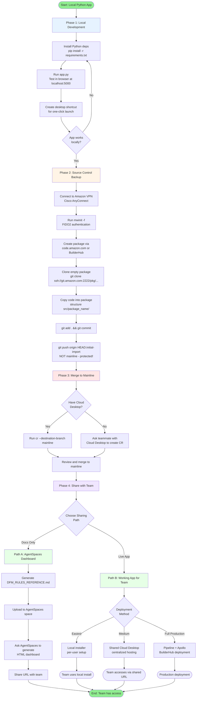

# DFM Inspector — Complete Setup and Deployment Guide

This guide walks through the full lifecycle of building, source-controlling, and sharing the DFM Inspector application — from local Python development to a shared HTML dashboard for team consumption.

**End Goal:** A fully working Python app (running in the background) that team members can use through an HTML dashboard.

---

## Table of Contents

1. [Process Flow Diagram](#process-flow-diagram)
2. [Phase 1: Local Development](#phase-1-local-development)
3. [Phase 2: Backing Up to code.amazon.com](#phase-2-backing-up-to-codeamazoncom)
4. [Phase 3: Merge to Mainline](#phase-3-merge-to-mainline)
5. [Phase 4: Sharing With Your Team](#phase-4-sharing-with-your-team)
6. [Quick Reference](#quick-reference)
7. [Troubleshooting](#troubleshooting)

---

## Process Flow Diagram



---

## Phase 1: Local Development

**Goal:** Get the app running on your local machine first.

### Prerequisites
- Windows laptop with administrator access
- Python 3.11+ installed
- ~500 MB of disk space for dependencies

### Step 1.1 — Install Python Dependencies

Open PowerShell in your project directory and run:

```powershell
pip install -r requirements.txt
```

Required packages include Flask, Trimesh, Cascadio, NumPy, CadQuery, and python-docx.

### Step 1.2 — Test the App Locally

```powershell
python app.py
```

The Flask server starts on port 5000. Open your browser to:

```
http://localhost:5000
```

Upload a sample STEP file and verify:
- Geometry parsing works
- DFM rule analysis runs
- Reports generate

### Step 1.3 — Create a Desktop Shortcut

For one-click launching, create `DFM_Inspector_Launcher.bat`:

```batch
@echo off
cd /d "%~dp0"
echo Starting DFM Inspector at http://localhost:5000
start "" /B cmd /c "timeout /t 3 /nobreak > nul && start http://localhost:5000"
python app.py
pause
```

Then create the shortcut with PowerShell:

```powershell
$shell = New-Object -ComObject WScript.Shell
$shortcut = $shell.CreateShortcut("$env:USERPROFILE\Desktop\DFM Inspector.lnk")
$shortcut.TargetPath = "C:\Path\To\DFM_Inspector_Launcher.bat"
$shortcut.WorkingDirectory = "C:\Path\To\Project"
$shortcut.Save()
```

**Result:** Double-click the desktop icon to launch the app anytime.

---

## Phase 2: Backing Up to code.amazon.com

**Goal:** Get your code into Amazon's source control so it's backed up and ready for team collaboration.

### Step 2.1 — Connect to Amazon VPN

Open Cisco AnyConnect and connect. The VPN must be active for all subsequent steps.

**Verify it works:**
```powershell
ping git.amazon.com
```
If pings succeed, VPN is good. If they time out, VPN isn't connecting properly.

### Step 2.2 — Authenticate with Midway

In PowerShell:

```powershell
mwinit -f
```

The `-f` flag uses FIDO2 (recommended). Follow the prompts:
1. Enter your Midway PIN
2. Touch your YubiKey or use Windows Hello

**Success looks like:**
- "Successfully authenticated using WebAuthN"
- "SSH certificate was saved in..."

This generates `~/.ssh/id_ecdsa-cert.pub` which authenticates you to `git.amazon.com` for ~20 hours.

### Step 2.3 — Create a Brazil Package

Navigate to `https://code.amazon.com/` in your browser.

1. Click **"Create Package"** in the sidebar
2. Select **"Python Brazil"** template (for Python apps)
3. Click **Next**
4. Fill in the form:
   - **Package Name:** Use CamelCase (e.g., `DFMAnalyzer`) — must be unique across Amazon
   - **Description:** Short one-liner about your tool
   - **Bindle:** Your team's bindle (security/permission group)
   - **Primary Export Control Type:** "None" for internal tools
   - **Package Permissions:** Default (Public source, Public artifacts, Buildable)
   - **Consumption Model:** Private
5. Click **Create Package**

**Result:** Package URL is `https://code.amazon.com/packages/<PackageName>/`

### Step 2.4 — Clone the Empty Package

```powershell
cd C:\Users\<your-username>
git clone ssh://git.amazon.com:2222/pkg/<PackageName>
cd <PackageName>
```

When prompted about the host fingerprint, type `yes`.

**You'll see** the BuilderHub-generated skeleton: `Config`, `setup.py`, `pyproject.toml`, `README.md`, etc.

### Step 2.5 — Copy Your Code into the Package

The skeleton expects code in `src/<package_name>/`. Copy your code:

```powershell
# Python modules go inside the package folder
Copy-Item "C:\Path\To\YourProject\src\*.py" "src\<package_name>\" -Force
Copy-Item "C:\Path\To\YourProject\src\inspectors" "src\<package_name>\inspectors" -Recurse -Force

# App entry points at the package root
Copy-Item "C:\Path\To\YourProject\app.py" "."
Copy-Item "C:\Path\To\YourProject\start_server.py" "."
Copy-Item "C:\Path\To\YourProject\requirements.txt" "."

# Templates and static directories
Copy-Item "C:\Path\To\YourProject\templates" "templates" -Recurse -Force
Copy-Item "C:\Path\To\YourProject\rules" "rules" -Recurse -Force

# Config files (use a different folder name to avoid conflict with Brazil's "Config" file)
New-Item -ItemType Directory -Path "dfm_config" -Force | Out-Null
Copy-Item "C:\Path\To\YourProject\config\*" "dfm_config\" -Recurse -Force

# Tests go in test/ (note: Brazil uses singular "test", not "tests")
Copy-Item "C:\Path\To\YourProject\tests\*.py" "test\" -Force
```

> **⚠ Watch out:** A folder called `config` will conflict with Brazil's `Config` file on Windows (case-insensitive filesystem). Rename to `dfm_config` or similar.

### Step 2.6 — Commit and Push to a Feature Branch

```powershell
git add .
git status   # Review what's being committed
git commit -m "feat: Initial import of DFM Inspector tool

DFM Inspector for manufacturing design-for-manufacturability analysis.
Supports CNC machining, sheet metal, die casting, injection molding,
welding, and other processes.

Standards: 930-00172, 930-00166, NADCA 11th Edition, ISO 2768."

# Push to a feature branch (NOT mainline - it's protected)
git push origin HEAD:refs/heads/initial-import
```

**Result:** Your code is on `code.amazon.com` at the `initial-import` branch.

> **⚠ Why not push to mainline directly?** Mainline is protected by GitFarm branch protection. Direct pushes are rejected with `gitfarm-branch-protection hook declined`. You must go through code review.

---

## Phase 3: Merge to Mainline

**Goal:** Get your code reviewed and merged into the `mainline` branch.

This phase requires the `cr` CLI tool which is **not available on Windows**. You have three options:

### Option A: Get a Cloud Desktop (Recommended Long-Term)

A Cloud Desktop is an Amazon Linux VM with all internal tools pre-installed.

1. Go to `https://clouddesktop.amazon.com/`
2. Request a new Cloud Desktop (your manager may need to approve)
3. SSH into it once provisioned
4. Run `mwinit` on the Cloud Desktop
5. Clone the package and create the CR:
   ```bash
   git clone ssh://git.amazon.com:2222/pkg/<PackageName>
   cd <PackageName>
   git checkout initial-import
   cr --destination-branch mainline \
      --summary "[<PackageName>] Initial import of DFM Inspector tool" \
      --reviewers <reviewer-alias>
   ```

### Option B: Ask a Teammate (Fastest)

If a teammate has a Cloud Desktop, send them:
- Package URL: `https://code.amazon.com/packages/<PackageName>/`
- Branch name: `initial-import`

They run the same `cr` command from their machine, review the changes, and merge.

### Option C: Stay on the Feature Branch (Defer)

Your code is safely backed up on `initial-import`. You can:
- Continue developing locally
- Push updates: `git push origin HEAD:initial-import`
- Skip mainline merge until you have Cloud Desktop access

This delays Phase 4B (live app deployment) but Phase 4A (rules dashboard) still works.

---

## Phase 4: Sharing With Your Team

You have two parallel paths — pick one or do both.

### Path A: AgentSpaces Rules Dashboard (Documentation)

**Best for:** Sharing the DFM rules and reference material with the team.

#### Step 4A.1 — Generate the Rules Reference Document

The `DFM_RULES_REFERENCE.md` file (already created) catalogs every rule the analyzer checks, organized by manufacturing process.

#### Step 4A.2 — Create an AgentSpaces Space

1. Go to AgentSpaces (your team's URL)
2. Click **Create Space** or **New Space**
3. Name it something descriptive (e.g., "DFM Reference")

#### Step 4A.3 — Upload Source Materials

Upload to the space:
- `DFM_RULES_REFERENCE.md` (the curated rules)
- Optionally: original PDFs from `Process Specs/` folder
- Optionally: the source `.py` files for context

#### Step 4A.4 — Ask AgentSpaces to Generate a Dashboard

Type a prompt like:

> Create an HTML dashboard from the DFM_RULES_REFERENCE.md document. Include:
> - Tabs for each manufacturing process
> - Tables for tolerance values and material specs
> - Color-coded rule cards (FAIL=red, WARNING=yellow, PASS=green)
> - A search bar to find specific rules
> - Quick reference cards for common cases

#### Step 4A.5 — Share the URL

AgentSpaces gives you a shareable URL. Send it to your team via Slack/email.

**Result:** Team has a browsable rules reference. They can click around and search rules but cannot upload STEP files for analysis.

---

### Path B: Working App for Team Use

**Best for:** Letting team members actually analyze their own STEP files.

Pick the deployment method based on team size and effort budget:

#### Method B1: Local Installer (Lowest Effort)

Each team member installs the app on their own machine.

**What you build:**
1. A setup script (`setup.bat` or `setup.ps1`) that:
   - Checks for Python 3.11+
   - Installs all dependencies
   - Creates the desktop shortcut
2. A README with troubleshooting tips
3. Distribute via internal Quip/SharePoint/file share

**Pros:** Zero hosting infrastructure, works offline
**Cons:** Each user installs separately, no centralized updates

**Effort:** 1-2 days

#### Method B2: Shared Cloud Desktop (Medium Effort)

Run the app once on a team-shared Cloud Desktop.

**What you build:**
1. A team Cloud Desktop that stays running 24/7
2. Open port 5000 to your team's network
3. Set up auto-restart with a process supervisor (systemd, supervisor)
4. Document the URL: `http://<cloud-desktop-name>:5000`

**Pros:** Centralized, single source of truth, instant updates
**Cons:** Limited to corp network, single user at a time, depends on Cloud Desktop staying up

**Effort:** 3-5 days

#### Method B3: Production Deployment via BuilderHub (High Effort)

Full Apollo/Pipeline-managed production deployment.

**What you build:**
1. **Pipeline** at `https://pipelines.amazon.com/`:
   - Source: your package on `mainline`
   - Stages: Build → Test → Beta Deploy → Approval → Prod Deploy
2. **Apollo Environment**:
   - Production WSGI server (gunicorn, not Flask dev server)
   - File storage in S3 (not `/tmp`)
   - Midway authentication
   - CloudWatch logging
3. **Dockerfile** packaging Python + native dependencies
4. **AppSec Review** before launch

**Pros:** Scales to many users, persistent, monitoring, auto-recovery
**Cons:** Requires mainline merge first, infrastructure costs, ongoing maintenance

**Effort:** 1-3 weeks initial setup

---

## Quick Reference

### Daily Workflow After Initial Setup

```powershell
# 1. Refresh Midway credentials (every ~20 hours)
mwinit -f

# 2. Make code changes locally in your dev folder

# 3. Sync changes to the Brazil package
Copy-Item "C:\Path\To\Dev\src\*.py" "C:\Users\<user>\<PackageName>\src\<package_name>\" -Force

# 4. Commit and push to feature branch
cd C:\Users\<user>\<PackageName>
git add .
git commit -m "<commit message>"
git push origin HEAD:initial-import
```

### Useful URLs

| Purpose | URL |
|---------|-----|
| Code browser | `https://code.amazon.com/packages/<PackageName>/` |
| Pipeline portal | `https://pipelines.amazon.com/` |
| Apollo portal | `https://apollo.amazon.com/` |
| Cloud Desktops | `https://clouddesktop.amazon.com/` |
| BuilderHub | `https://builderhub.corp.amazon.com/` |
| Spec Studio | Click "Spec Studio" tab on package page |

### File Structure in Brazil Package

```
<PackageName>/
├── Config              # Brazil build config (DO NOT remove)
├── setup.py            # Python package metadata
├── setup.cfg           # Linting/formatting config
├── pyproject.toml      # Build system requirements
├── README.md           # Package documentation
├── DEVELOPMENT.md      # Developer notes
├── .gitignore          # Files to exclude from git
├── app.py              # Flask app entry point
├── start_server.py     # Server startup script
├── requirements.txt    # Python dependencies (reference)
├── doc/                # Sphinx docs
├── src/
│   └── <package_name>/      # All Python modules go HERE
│       ├── __init__.py
│       ├── *.py
│       └── inspectors/
├── test/                    # Tests (singular "test")
├── templates/               # HTML templates
├── rules/                   # Manufacturing rule definitions
└── dfm_config/              # YAML config (NOT "config" — conflicts with Brazil Config file)
```

---

## Troubleshooting

### "Permission denied (keyboard-interactive,publickey,gssapi-with-mic)"

You need fresh Midway credentials. Run:

```powershell
mwinit -f
```

### "gitfarm-branch-protection hook declined the push"

You're trying to push to a protected branch (mainline). Push to a feature branch instead:

```powershell
git push origin HEAD:refs/heads/initial-import
```

Then go to Phase 3 to merge via code review.

### "Container cannot be copied onto existing leaf item"

You tried to copy a folder over an existing file. On Windows, the `Config` file (Brazil) and a `config/` folder cannot coexist. Rename your folder:

```powershell
New-Item -ItemType Directory -Path "dfm_config" -Force | Out-Null
Copy-Item "...\config\*" "dfm_config\" -Recurse -Force
```

### "cr is not recognized as a command"

The `cr` CLI tool is not available on Windows. Either:
- Get a Cloud Desktop (recommended)
- Ask a teammate to create the CR for you

### "VPN connected but localhost doesn't work"

Some VPN clients (Zscaler) intercept localhost traffic. Disconnect from VPN when using `http://localhost:5000`. The local app doesn't need VPN — only Amazon-internal services do.

### "mwinit fails with curl timeout"

You're not on VPN, or your network can't reach `midway-auth.amazon.com`. Verify:

```powershell
ping midway-auth.amazon.com
```

If pings fail, fix VPN connection first.

### "Spec Studio Code Change Status shows 'Unknown'"

Spec Studio's "Request Change" is an AI code-generation tool, not a CR creation tool. Don't use it to merge existing code. Use `cr` CLI instead (requires Cloud Desktop).

---

## Summary: Path to Done

1. **Phase 1 (Hours):** Get app running locally → desktop shortcut
2. **Phase 2 (Hour):** Push code to `code.amazon.com` `initial-import` branch  
3. **Phase 3 (Day):** Get Cloud Desktop access → create CR → merge to mainline
4. **Phase 4A (Hour):** Generate rules dashboard via AgentSpaces → share URL
5. **Phase 4B (Days-Weeks):** Pick deployment method → ship live app to team

**Minimum Viable Sharing:** Phase 1 + 4A (skip 2-3) gets you a rules dashboard in a day.

**Full Production:** All phases gets you a scaled, monitored production app.
